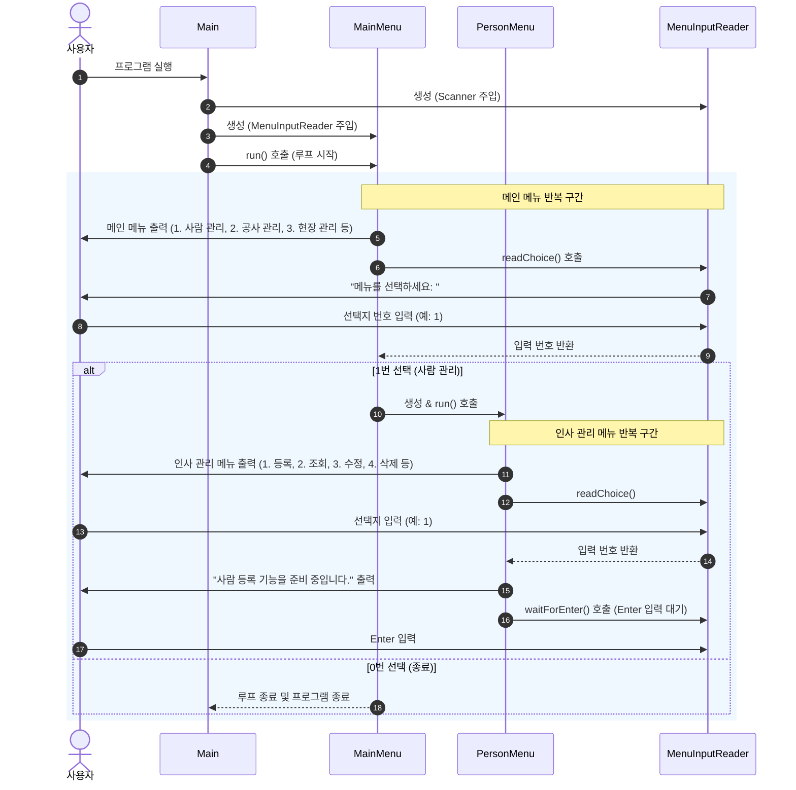

# 남강조경 시스템 (NGSP_JAVA) 프로젝트 분석 보고서

이 보고서는 `NGSP_JAVA` 프로젝트의 폴더 구조와 클래스의 역할을 정의하고, 현재 구현된 애플리케이션의 실행 흐름 및 향후 SQLite 데이터베이스와 CSV 연동이 이루어질 때의 흐름에 대해 분석한 내용입니다.

---

## 1. 프로젝트 폴더 구조 및 클래스 역할

현재 프로젝트의 디렉토리 구조와 각 패키지/클래스의 역할은 다음과 같습니다.

### 📂 전체 디렉토리 구조
```text
src/
├── Main.java                      # 프로그램 진입점
├── config/                        # 시스템 설정 상수 패키지
│   ├── CsvConfig.java             # CSV 관련 설정
│   ├── DatabaseConfig.java        # DB 연결 정보 설정 (현재 미구현)
│   ├── PathConfig.java            # 파일 경로 설정 (DB, CSV)
│   └── UiConfig.java              # UI 텍스트 및 레이아웃 설정
├── data/                          # 데이터 소스 및 저장소 패키지 (현재 비어 있음)
│   ├── database/                  # SQLite DB 파일 저장 폴더
│   └── input/                     # CSV 입력 파일 저장 폴더
├── model/                         # 도메인 모델 패키지
│   ├── Person.java                # 사람 데이터 모델 (조회용 Entity/DTO)
│   └── PersonCreate.java          # 사람 등록용 데이터 모델 (ID 제외 DTO)
└── ui/                            # 사용자 인터페이스 패키지
    ├── input/
    │   └── MenuInputReader.java   # 콘솔 입력 처리기
    └── menu/
        ├── MainMenu.java          # 메인 메뉴 화면
        ├── PersonMenu.java        # 인사 관리 메뉴 화면
        └── PersonRegistrationMenu.java # 사람 등록 상세 메뉴 화면
```

### 📋 클래스별 세부 역할

| 패키지 | 클래스명 | 역할 설명 |
| :--- | :--- | :--- |
| **(default)** | `Main` | 애플리케이션 시작을 담당합니다. `Scanner`, `MenuInputReader`, `MainMenu`를 인스턴스화하고 프로그램을 구동합니다. |
| **config** | `CsvConfig` | CSV 파일을 읽고 쓸 때 사용할 기본 인코딩 값(`UTF-8`)을 상수로 관리합니다. |
| **config** | `DatabaseConfig` | SQLite 데이터베이스 연결 주소(`DB_URL`)를 상수로 정의합니다. (현재 빈 값 `""`) |
| **config** | `PathConfig` | SQLite DB 파일(`data/database/database.db`)과 인사 정보 CSV 파일(`data/input/person.csv`)의 경로 상수를 관리합니다. |
| **config** | `UiConfig` | 애플리케이션 이름, 구분선 디자인, 기본 입력 에러 상수 등을 정의합니다. 객체 생성을 막기 위해 `private` 생성자를 가지고 있습니다. |
| **model** | `Person` | 시스템에 저장된 사람의 정보(ID, 이름, 전화번호, 성별 ID, 주소)를 담는 불변(Immutable) 데이터 모델입니다. |
| **model** | `PersonCreate` | 신규 사람을 등록할 때 사용하는 데이터 모델로, DB에서 자동 생성될 고유 ID 필드가 제외되어 있습니다. |
| **ui.input** | `MenuInputReader` | 사용자로부터 입력을 받는 헬퍼 클래스입니다. 메뉴 번호 입력 예외 처리(`readChoice`) 및 대기 기능(`waitForEnter`)을 포함합니다. |
| **ui.menu** | `MainMenu` | 프로그램의 최상위 콘솔 UI입니다. 사람 관리, 공사 관리, 현장 관리 등의 선택을 수행합니다. |
| **ui.menu** | `PersonMenu` | 인사 관리의 핵심 메뉴를 보여줍니다. 사람 등록, 조회, 수정, 삭제 분기를 제공합니다. (현재 플레이스홀더 콘솔 출력만 구현됨) |
| **ui.menu** | `PersonRegistrationMenu` | 인사 등록 시 상세 분기(콘솔에서 직접 등록 vs CSV 파일로 일괄 등록)를 제공하는 메뉴 클래스입니다. |

---

## 2. 애플리케이션 실행 흐름 분석

현재 프로젝트는 **사용자 입력을 받아 동작하는 CLI 형태의 뼈대(Skeletal UI)**가 잡혀 있는 상태이며, 실제 기능(SQLite 연동 및 CSV 파싱)은 아직 연결되어 있지 않습니다.

### 🔄 현재 CLI 실행 흐름



---

## 3. 향후 SQLite 및 CSV 연동 설계 방향 (Main ➡️ SQLite 흐름)

현재 비어 있는 `data` 레이어와 기능들을 연결하기 위해서는 다음과 같은 데이터 처리 흐름이 구현되어야 합니다.

```mermaid
graph TD
    User([사용자]) --> UI[ui.menu.PersonMenu]
    
    subgraph UI Layer
        UI -->|1. 등록 선택| RegMenu[ui.menu.PersonRegistrationMenu]
        UI -->|2. 조회 선택| SelectProc[조회 로직]
    end

    subgraph Service / DAO Layer (향후 구현 필요)
        RegMenu -->|직접 입력| PersonService[Person Service]
        RegMenu -->|CSV 파일| CsvReader[CSV File Reader]
        SelectProc --> PersonService
        
        CsvReader -->|CSV 파싱| PersonCreateDTO[model.PersonCreate]
        PersonService -->|데이터 매핑| PersonCreateDTO
    end

    subgraph Data Layer
        PersonService -->|JDBC Query| Database[(SQLite DB)]
        CsvReader -->|파일 읽기| CSVFile[data/input/person.csv]
    end
    
    Database -.->|PathConfig 참조| DBFile[data/database/database.db]
```

### 1️⃣ SQLite 연동을 위한 흐름
1. **DB 연결 활성화**: 
   - `DatabaseConfig.DB_URL`에 SQLite URL을 설정합니다 (예: `jdbc:sqlite:data/database/database.db`).
   - 프로그램 기동 시 혹은 첫 쿼리 실행 시 `DriverManager.getConnection(DB_URL)`을 호출하여 SQLite 커넥션을 맺습니다.
2. **데이터 처리 (DAO/Repository 구현 필요)**:
   - **조회 흐름**: `PersonMenu` ➡️ `PersonDAO.findAll()` ➡️ SQLite DB (`SELECT * FROM person`) ➡️ `ResultSet`을 읽어 `Person` 객체 리스트 생성 ➡️ 화면 출력
   - **직접 등록 흐름**: `PersonRegistrationMenu` ➡️ 사용자 정보 입력 ➡️ `PersonCreate` 객체 생성 ➡️ `PersonDAO.insert(PersonCreate)` ➡️ SQLite DB (`INSERT INTO person ...`)

### 2️⃣ CSV 파일 일괄 등록 흐름
1. `PersonRegistrationMenu`에서 `2. CSV 파일로 일괄 등록`을 선택합니다.
2. `PathConfig.PERSON_CSV` 경로의 CSV 파일 존재 여부를 체크합니다.
3. 파일이 존재하면 `CsvConfig.ENCODING`을 참조해 BufferedReader 또는 OpenCSV 라이브러리 등을 사용하여 CSV 레코드를 한 줄씩 파싱합니다.
4. 파싱된 각 라인 데이터를 `PersonCreate` 객체로 변환하고, SQLite DB에 Batch Insert (`PreparedStatement.addBatch()`) 처리하여 대량의 데이터를 DB에 일괄 저장합니다.
