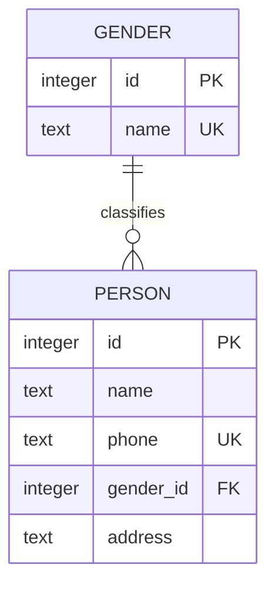
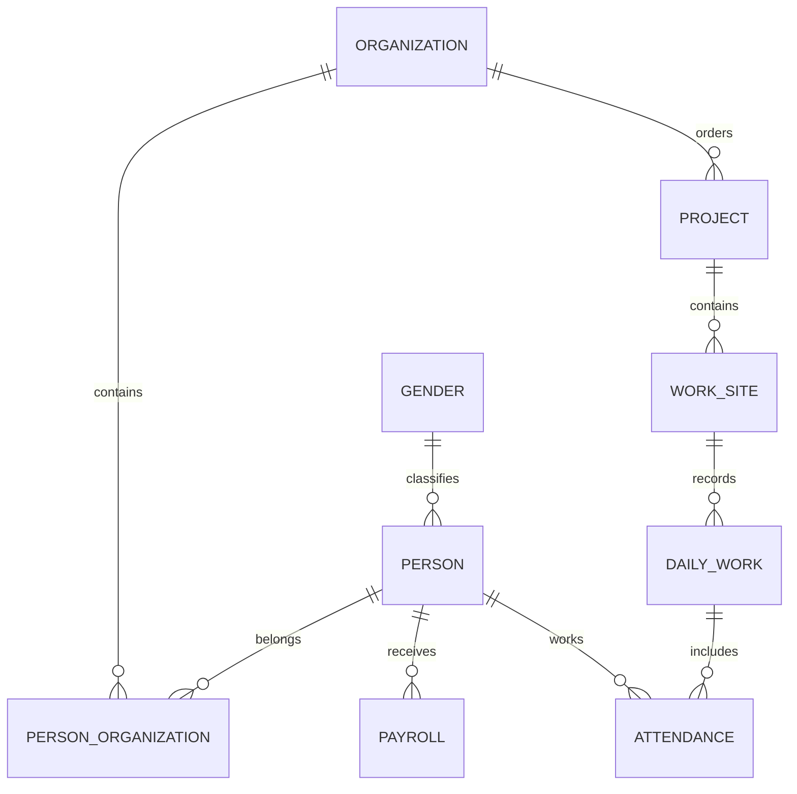

# NGSP_JAVA 데이터베이스 설계

## 1. 문서 개요

### 1.1 문서 목적

이 문서는 `NGSP_JAVA` 프로젝트에서 사용하는 SQLite 데이터베이스의 설계 원칙과 테이블 구조를 정의합니다.

주요 목적은 다음과 같습니다.

* 프로그램에서 사용하는 데이터를 일관된 형식으로 저장
* Java 객체와 데이터베이스 테이블의 관계 정의
* 중복 데이터와 잘못된 데이터 저장 방지
* 사람, 공사, 현장, 근로 기록 및 급여 기능의 확장 기반 마련
* Repository 구현 시 따라야 할 SQL 작성 기준 정의
* 데이터베이스 구조 변경 시 판단 기준 제공

이 문서는 초기 사람 관리 기능을 중심으로 작성하며, 실제 기능이 추가될 때마다 내용을 갱신합니다.

---

## 2. 데이터베이스 개요

### 2.1 데이터베이스 종류

```text
Database      SQLite
Access API    JDBC
Database File data/database/database.db
JDBC URL      jdbc:sqlite:data/database/database.db
```

SQLite를 선택한 이유는 다음과 같습니다.

* 별도의 데이터베이스 서버가 필요하지 않음
* 하나의 파일로 데이터를 관리할 수 있음
* 로컬 CLI 프로그램에 적합함
* 백업과 이동이 간단함
* Java JDBC를 통해 사용할 수 있음
* 현재 프로젝트 규모에 충분한 성능을 제공함

---

### 2.2 데이터베이스 파일 위치

프로젝트의 데이터 파일은 소스 코드와 분리합니다.

```text
NGSP_JAVA/
├── data/
│   ├── database/
│   │   └── database.db
│   └── input/
│       └── person.csv
│
├── docs/
│   ├── analysis_results.md
│   ├── architecture.md
│   └── database_design.md
│
└── src/
```

Java 코드에서는 경로를 직접 반복 작성하지 않고 `PathConfig`에서 관리합니다.

```java
public static final Path DATABASE_PATH =
        Path.of("data", "database", "database.db");
```

`DatabaseConfig`에서는 이 경로를 JDBC URL로 변환합니다.

```java
public static final String DB_URL =
        "jdbc:sqlite:" + PathConfig.DATABASE_PATH;
```

---

## 3. 설계 원칙

### 3.1 관계형 데이터베이스 사용

NGSP_JAVA는 사람, 공사, 현장, 조직, 근무 기록 등 서로 관계가 있는 데이터를 관리합니다.

따라서 각 정보를 하나의 테이블에 모두 저장하지 않고, 독립적인 대상별로 테이블을 나누고 외래키로 연결합니다.

잘못된 구조의 예:

```text
person
├── 사람 이름
├── 전화번호
├── 성별 이름
├── 회사 이름
├── 현장 이름
├── 공사 이름
├── 근무 날짜
└── 임금
```

이 구조에서는 같은 사람의 이름과 전화번호가 근무일마다 반복 저장됩니다.

권장 구조:

```text
person
organization
project
work_site
daily_work
attendance
payroll
```

각 테이블은 고유한 대상을 저장하고, ID를 통해 서로 연결합니다.

---

### 3.2 데이터 중복 최소화

반복되는 기준 정보는 별도 테이블로 분리합니다.

예를 들어 성별을 `person` 테이블에 문자열로 반복 저장할 수 있습니다.

```text
남성
여성
남성
남성
여성
```

현재 설계에서는 성별 기준을 `gender` 테이블에서 관리하고 `person.gender_id`로 연결합니다.

```text
gender
1 Male
2 Female
```

```text
person
홍길동 → gender_id 1
이순신 → gender_id 1
김영희 → gender_id 2
```

이를 통해 다음 장점을 얻습니다.

* 허용된 성별 값만 저장 가능
* 오탈자 방지
* 데이터 표현 통일
* 기준값 변경 용이

---

### 3.3 식별자는 ID 사용

각 주요 테이블은 내부 식별자로 정수형 ID를 사용합니다.

```sql
id INTEGER PRIMARY KEY AUTOINCREMENT
```

사람 이름이나 전화번호를 기본키로 사용하지 않습니다.

이유는 다음과 같습니다.

* 같은 이름을 가진 사람이 존재할 수 있음
* 전화번호가 변경될 수 있음
* 이름도 수정될 수 있음
* 다른 테이블에서 정수 ID로 연결하는 것이 안정적임

---

### 3.4 사용자 표시값과 저장값 분리

사용자가 입력하고 보는 형식과 데이터베이스 저장 형식은 다를 수 있습니다.

전화번호 예:

```text
사용자 입력: 010-1234-5678
DB 저장:     01012345678
화면 출력:   010-1234-5678
```

처리 과정:

```text
사용자 입력
→ 정규화
→ 검증
→ DB 저장
→ 조회
→ 출력 형식 적용
```

데이터베이스에는 검색과 비교가 쉬운 표준 형식으로 저장합니다.

---

### 3.5 외래키 무결성 사용

SQLite는 연결별로 외래키 검사를 활성화해야 합니다.

```sql
PRAGMA foreign_keys = ON;
```

모든 데이터베이스 연결에서 이 설정이 적용되도록 합니다.

외래키를 사용하는 이유는 존재하지 않는 기준 데이터를 참조하는 것을 방지하기 위해서입니다.

예를 들어 다음 데이터는 허용하지 않아야 합니다.

```text
person.gender_id = 9
```

`gender` 테이블에 ID 9가 없다면 저장에 실패해야 합니다.

---

### 3.6 초기에는 필요한 필드만 추가

향후 필요할 가능성만으로 필드를 과도하게 추가하지 않습니다.

현재 사람 등록에 필요한 데이터:

```text
이름
전화번호
성별
주소
```

향후 검토할 수 있는 데이터:

```text
생년월일
근로자 유형
재직 상태
소속
직책
계좌 정보
등록일
수정일
```

실제 기능이 구현될 때 요구사항을 확인한 후 추가합니다.

---

## 4. 현재 데이터베이스 관계

현재 확정된 초기 테이블은 다음 두 개입니다.

```text
gender
person
```

관계:

```text
gender 1 ───── N person
```

하나의 성별 기준은 여러 사람에게 사용될 수 있습니다.

한 사람은 하나의 성별 기준을 참조합니다.



---

## 5. gender 테이블

### 5.1 테이블 목적

`gender` 테이블은 사람 등록 시 사용할 성별 기준값을 관리합니다.

사용자가 임의의 문자열을 입력해 데이터가 불규칙하게 저장되는 것을 방지합니다.

---

### 5.2 테이블 정의

```sql
CREATE TABLE IF NOT EXISTS gender (
    id INTEGER PRIMARY KEY,
    name TEXT NOT NULL UNIQUE
);
```

---

### 5.3 컬럼 정의

| 컬럼     | 자료형     | 제약조건             | 설명       |
| ------ | ------- | ---------------- | -------- |
| `id`   | INTEGER | PRIMARY KEY      | 성별 식별자   |
| `name` | TEXT    | NOT NULL, UNIQUE | 성별 내부 이름 |

---

### 5.4 초기 데이터

```sql
INSERT OR IGNORE INTO gender (id, name)
VALUES
    (1, 'Male'),
    (2, 'Female');
```

초기값:

| ID | 내부 저장값 | 화면 표시값 |
| -: | ------ | ------ |
|  1 | Male   | 남성     |
|  2 | Female | 여성     |

화면 표시값은 Java의 Formatter 또는 UI에서 한글로 변환할 수 있습니다.

데이터베이스 내부 값과 화면 언어를 반드시 동일하게 만들 필요는 없습니다.

---

### 5.5 ID 자동 증가를 사용하지 않는 이유

`gender`는 프로그램에서 미리 정의된 소수의 기준값입니다.

따라서 다음처럼 고정 ID를 사용합니다.

```text
1 = Male
2 = Female
```

고정 ID를 사용하면 CSV 파일에서도 다음처럼 간단하게 입력할 수 있습니다.

```csv
name,phone,gender_id,address
홍길동,01012345678,1,경상남도 의령군
김영희,01098765432,2,경상남도 진주시
```

---

## 6. person 테이블

### 6.1 테이블 목적

`person` 테이블은 시스템에서 관리하는 한 사람의 기본 정보를 저장합니다.

한 행은 한 명의 사람을 나타냅니다.

---

### 6.2 테이블 정의

```sql
CREATE TABLE IF NOT EXISTS person (
    id INTEGER PRIMARY KEY AUTOINCREMENT,
    name TEXT NOT NULL,
    phone TEXT UNIQUE,
    gender_id INTEGER NOT NULL,
    address TEXT,
    FOREIGN KEY (gender_id)
        REFERENCES gender(id)
);
```

---

### 6.3 컬럼 정의

| 컬럼          | 자료형     | 제약조건                       | 설명             |
| ----------- | ------- | -------------------------- | -------------- |
| `id`        | INTEGER | PRIMARY KEY, AUTOINCREMENT | 사람 고유 식별자      |
| `name`      | TEXT    | NOT NULL                   | 사람 이름          |
| `phone`     | TEXT    | UNIQUE                     | 숫자만 저장한 전화번호   |
| `gender_id` | INTEGER | NOT NULL, FOREIGN KEY      | `gender.id` 참조 |
| `address`   | TEXT    | NULL 허용                    | 주소             |

---

### 6.4 id

```sql
id INTEGER PRIMARY KEY AUTOINCREMENT
```

사람이 등록될 때 SQLite가 자동으로 생성합니다.

예:

```text
1 홍길동
2 김영희
3 이순신
```

Java의 `PersonCreate`에는 ID가 없습니다.

```java
public record PersonCreate(
        String name,
        String phone,
        int genderId,
        String address
) {
}
```

데이터베이스에서 조회한 `Person`에는 ID가 포함됩니다.

```java
public record Person(
        long id,
        String name,
        String phone,
        int genderId,
        String address
) {
}
```

---

### 6.5 name

```sql
name TEXT NOT NULL
```

이름은 필수값입니다.

데이터베이스 제약조건 외에도 Service 또는 Validator에서 다음 내용을 검사합니다.

* `null`이 아님
* 빈 문자열이 아님
* 공백만 입력하지 않음
* 앞뒤 공백 제거
* 필요시 최소 길이 검사
* 필요시 최대 길이 검사

예:

```text
입력: "  홍길동  "
저장: "홍길동"
```

동명이인이 존재할 수 있으므로 `UNIQUE`는 적용하지 않습니다.

---

### 6.6 phone

```sql
phone TEXT UNIQUE
```

전화번호는 계산할 숫자가 아니므로 `INTEGER`가 아닌 `TEXT`로 저장합니다.

이유:

* 전화번호 앞의 `0`을 유지해야 함
* 산술 계산을 하지 않음
* 국가번호나 다른 형식으로 확장될 수 있음
* 숫자 문자열로 비교하는 것이 적합함

저장 형식:

```text
01012345678
```

허용할 수 있는 사용자 입력:

```text
01012345678
010-1234-5678
010 1234 5678
```

정규화 후 저장:

```text
01012345678
```

현재는 동일 전화번호를 가진 사람의 중복 등록을 막기 위해 `UNIQUE`를 적용합니다.

전화번호가 없는 사람도 등록할 필요가 생기면 `NULL`을 허용할 수 있습니다. SQLite에서는 `UNIQUE` 컬럼에 여러 개의 `NULL`을 저장할 수 있습니다.

다만 빈 문자열 `''`을 여러 번 저장하는 것은 허용되지 않을 수 있으므로 전화번호 미입력은 빈 문자열이 아닌 `NULL`로 처리해야 합니다.

---

### 6.7 gender_id

```sql
gender_id INTEGER NOT NULL
```

외래키:

```sql
FOREIGN KEY (gender_id)
    REFERENCES gender(id)
```

허용 예:

```text
1
2
```

허용하지 않는 예:

```text
0
3
9
```

유효한 ID인지 Service에서 먼저 확인할 수 있지만, 최종 무결성은 데이터베이스 외래키가 보장합니다.

---

### 6.8 address

```sql
address TEXT
```

현재 설계에서는 주소 입력을 선택값으로 봅니다.

주소를 필수 입력으로 확정하면 다음과 같이 변경할 수 있습니다.

```sql
address TEXT NOT NULL
```

주소는 초기에 하나의 문자열로 저장합니다.

예:

```text
경상남도 의령군 의령읍
```

향후 우편번호, 도로명주소, 상세주소 검색 기능이 필요해질 때 컬럼 분리를 검토합니다.

```text
postal_code
road_address
detail_address
```

현재 단계에서는 과도한 분리를 하지 않습니다.

---

## 7. 테이블 생성 순서

외래키 관계 때문에 부모 테이블을 먼저 생성합니다.

```text
1. gender
2. gender 기본 데이터
3. person
```

초기화 순서:

```java
public void initialize() {
    createDataDirectory();
    createGenderTable();
    insertDefaultGenders();
    createPersonTable();
}
```

SQL 실행 순서:

```sql
PRAGMA foreign_keys = ON;

CREATE TABLE IF NOT EXISTS gender (...);

INSERT OR IGNORE INTO gender (...);

CREATE TABLE IF NOT EXISTS person (...);
```

`person` 테이블을 먼저 만들거나 데이터를 먼저 넣는 방식은 피합니다.

---

## 8. DatabaseInitializer 설계

### 8.1 책임

`DatabaseInitializer`는 프로그램 사용에 필요한 데이터베이스 구조를 준비합니다.

담당 기능:

* 데이터베이스 디렉토리 생성
* 데이터베이스 파일 연결
* 외래키 활성화
* 기준 테이블 생성
* 초기 기준값 입력
* 업무 테이블 생성

---

### 8.2 실행 시점

프로그램 시작 시 한 번 실행합니다.

```text
Main
→ DatabaseInitializer.initialize()
→ MainMenu.run()
```

---

### 8.3 데이터 보존 원칙

초기화는 데이터베이스를 매번 새로 만드는 작업이 아닙니다.

다음 문법을 사용합니다.

```sql
CREATE TABLE IF NOT EXISTS
```

```sql
INSERT OR IGNORE
```

프로그램을 다시 실행해도 기존 사람 정보가 유지되어야 합니다.

금지:

```sql
DROP TABLE person;
```

```sql
DELETE FROM person;
```

초기화 과정에서 기존 업무 데이터를 삭제해서는 안 됩니다.

---

### 8.4 초기 구현 예시

```java
public final class DatabaseInitializer {

    public void initialize() {
        createDatabaseDirectory();

        try (Connection connection =
                     DatabaseConnection.getConnection()) {

            enableForeignKeys(connection);
            createGenderTable(connection);
            insertDefaultGenders(connection);
            createPersonTable(connection);

        } catch (SQLException error) {
            throw new IllegalStateException(
                    "데이터베이스 초기화에 실패했습니다.",
                    error
            );
        }
    }
}
```

---

## 9. DatabaseConnection 설계

### 9.1 책임

`DatabaseConnection`은 SQLite 연결을 생성하여 반환합니다.

```java
public final class DatabaseConnection {

    private DatabaseConnection() {
    }

    public static Connection getConnection()
            throws SQLException {

        Connection connection =
                DriverManager.getConnection(
                        DatabaseConfig.DB_URL
                );

        try (Statement statement =
                     connection.createStatement()) {

            statement.execute(
                    "PRAGMA foreign_keys = ON"
            );
        }

        return connection;
    }
}
```

외래키 설정은 연결마다 적용해야 하므로 연결 생성 직후 활성화하는 것이 안전합니다.

---

### 9.2 연결 관리 원칙

각 Repository 메서드는 필요한 시점에 연결을 생성하고 `try-with-resources`로 닫습니다.

```java
try (
        Connection connection =
                DatabaseConnection.getConnection();

        PreparedStatement statement =
                connection.prepareStatement(sql)
) {
    // SQL 실행
}
```

현재 SQLite 기반 로컬 프로그램에서는 장시간 하나의 전역 연결을 계속 유지하는 방식보다, 필요한 작업마다 연결하고 닫는 단순한 구조로 시작합니다.

---

## 10. PersonRepository SQL 설계

### 10.1 사람 등록

```sql
INSERT INTO person (
    name,
    phone,
    gender_id,
    address
)
VALUES (?, ?, ?, ?);
```

Java 메서드:

```java
public long insert(PersonCreate person)
```

반환값:

```text
새로 생성된 person.id
```

`Statement.RETURN_GENERATED_KEYS`를 사용해 생성된 ID를 가져옵니다.

---

### 10.2 전체 사람 조회

초기 기본 조회:

```sql
SELECT
    id,
    name,
    phone,
    gender_id,
    address
FROM person
ORDER BY id;
```

성별 이름을 함께 조회하는 방식:

```sql
SELECT
    p.id,
    p.name,
    p.phone,
    p.gender_id,
    g.name AS gender_name,
    p.address
FROM person AS p
JOIN gender AS g
    ON g.id = p.gender_id
ORDER BY p.id;
```

초기 `Person` 모델에 `genderName`이 없으면 `gender_id`만 조회하고 화면에서 변환할 수 있습니다.

향후 조회 전용 모델을 추가할 수 있습니다.

```java
public record PersonDetail(
        long id,
        String name,
        String phone,
        int genderId,
        String genderName,
        String address
) {
}
```

---

### 10.3 ID로 사람 조회

```sql
SELECT
    id,
    name,
    phone,
    gender_id,
    address
FROM person
WHERE id = ?;
```

Java 메서드:

```java
public Optional<Person> findById(long id)
```

조회 결과가 없을 수 있으므로 `Optional<Person>`을 사용합니다.

---

### 10.4 전화번호 중복 확인

```sql
SELECT EXISTS (
    SELECT 1
    FROM person
    WHERE phone = ?
);
```

Java 메서드:

```java
public boolean existsByPhone(String phone)
```

서비스에서 등록 전에 사용자 친화적인 오류를 표시하기 위해 사용할 수 있습니다.

단, 동시 실행 상황에서 최종 중복 방지는 데이터베이스의 `UNIQUE` 제약조건이 담당합니다.

---

### 10.5 사람 수정

```sql
UPDATE person
SET
    name = ?,
    phone = ?,
    gender_id = ?,
    address = ?
WHERE id = ?;
```

Java 메서드:

```java
public boolean update(Person person)
```

`executeUpdate()`가 반환한 변경 행 수로 성공 여부를 판단합니다.

```text
1 → 수정 성공
0 → 해당 ID 없음
```

---

### 10.6 사람 삭제

초기 물리 삭제:

```sql
DELETE FROM person
WHERE id = ?;
```

Java 메서드:

```java
public boolean deleteById(long id)
```

향후 사람을 참조하는 근무 기록이나 급여 데이터가 생기면 물리 삭제 대신 논리 삭제를 검토합니다.

---

## 11. 논리 삭제 확장안

사람이 공사, 출근, 임금 기록과 연결되면 기존 사람 행을 삭제하는 것은 위험합니다.

예:

```text
홍길동의 person 행 삭제
→ 과거 출근 기록이 누구의 기록인지 알 수 없음
```

이 경우 `status` 또는 `deleted_at` 컬럼을 사용합니다.

### 11.1 status 방식

```sql
ALTER TABLE person
ADD COLUMN status TEXT NOT NULL DEFAULT 'ACTIVE';
```

허용값 예:

```text
ACTIVE
INACTIVE
DELETED
```

삭제 처리:

```sql
UPDATE person
SET status = 'INACTIVE'
WHERE id = ?;
```

일반 조회:

```sql
SELECT *
FROM person
WHERE status = 'ACTIVE';
```

---

### 11.2 deleted_at 방식

```sql
ALTER TABLE person
ADD COLUMN deleted_at TEXT;
```

삭제 처리:

```sql
UPDATE person
SET deleted_at = CURRENT_TIMESTAMP
WHERE id = ?;
```

일반 조회:

```sql
SELECT *
FROM person
WHERE deleted_at IS NULL;
```

초기 CRUD 학습 단계에서는 물리 삭제를 구현할 수 있지만, 업무 데이터 연결 전에 논리 삭제로 전환할지 결정해야 합니다.

---

## 12. 날짜와 시간 저장 원칙

SQLite에는 전용 날짜 자료형이 없습니다.

날짜와 시간은 ISO 8601 형식의 `TEXT`로 저장하는 것을 권장합니다.

날짜:

```text
2026-07-21
```

날짜와 시간:

```text
2026-07-21T14:30:00
```

향후 추가 가능 컬럼:

```sql
created_at TEXT NOT NULL DEFAULT CURRENT_TIMESTAMP,
updated_at TEXT NOT NULL DEFAULT CURRENT_TIMESTAMP
```

단, SQLite의 `CURRENT_TIMESTAMP`는 기본적으로 UTC를 사용합니다.

한국 시간 처리 기준은 애플리케이션 계층에서 명확히 정해야 합니다.

권장 방식:

```text
DB 저장: UTC 또는 명시된 ISO 문자열
화면 출력: Asia/Seoul 시간으로 변환
```

초기 프로젝트에서는 날짜 기능이 실제로 필요할 때 적용합니다.

---

## 13. NULL과 빈 문자열 처리 원칙

`NULL`과 빈 문자열은 의미가 다릅니다.

```text
NULL  = 값이 없음
""    = 값은 있지만 길이가 0인 문자열
" "   = 공백 문자가 저장된 문자열
```

권장 기준:

| 상황           | 저장값           |
| ------------ | ------------- |
| 필수 입력 누락     | 저장 거부         |
| 선택 입력을 하지 않음 | NULL          |
| 앞뒤 공백이 있는 값  | trim 후 저장     |
| 공백만 입력       | NULL 또는 저장 거부 |
| 전화번호 미입력     | NULL          |
| 주소 미입력       | NULL          |

Java에서 빈 선택값을 DB에 저장할 때는 다음처럼 처리할 수 있습니다.

```java
if (address == null || address.isBlank()) {
    statement.setNull(4, Types.VARCHAR);
} else {
    statement.setString(4, address.trim());
}
```

---

## 14. 제약조건 설계

### 14.1 NOT NULL

반드시 필요한 값에 적용합니다.

현재 적용:

```text
person.name
person.gender_id
gender.name
```

---

### 14.2 UNIQUE

중복을 허용하지 않는 값에 적용합니다.

현재 적용:

```text
gender.name
person.phone
```

주의:

사람 이름은 동명이인이 있을 수 있으므로 `UNIQUE`를 적용하지 않습니다.

---

### 14.3 FOREIGN KEY

다른 테이블의 데이터와 연결할 때 사용합니다.

현재 적용:

```text
person.gender_id → gender.id
```

향후 적용 예:

```text
work_site.project_id → project.id
attendance.person_id → person.id
attendance.work_site_id → work_site.id
payroll.person_id → person.id
```

---

### 14.4 CHECK 제약조건

필요하면 허용 범위를 데이터베이스에서도 제한할 수 있습니다.

예:

```sql
gender_id INTEGER NOT NULL
    CHECK (gender_id IN (1, 2))
```

그러나 `gender` 외래키가 이미 존재하므로 현재 구조에서는 별도의 `CHECK`가 필수는 아닙니다.

전화번호 길이 제한 예:

```sql
phone TEXT UNIQUE
    CHECK (
        phone IS NULL
        OR length(phone) = 11
    )
```

초기에는 Java Validator와 `UNIQUE`, `FOREIGN KEY`를 중심으로 구현하고, 안정화 후 DB `CHECK`를 추가할 수 있습니다.

---

## 15. 인덱스 설계

SQLite는 다음 컬럼에 자동으로 인덱스를 생성합니다.

* PRIMARY KEY
* UNIQUE

따라서 현재 다음 컬럼은 별도 인덱스가 필요하지 않습니다.

```text
person.id
person.phone
gender.id
gender.name
```

사람 이름 검색이 많아지면 다음 인덱스를 검토할 수 있습니다.

```sql
CREATE INDEX IF NOT EXISTS
    idx_person_name
ON person(name);
```

인덱스는 조회 속도를 높이지만 입력과 수정 비용 및 파일 크기를 늘립니다.

초기 데이터가 많지 않은 단계에서는 불필요한 인덱스를 추가하지 않습니다.

---

## 16. 트랜잭션 설계

### 16.1 단일 등록

사람 한 명을 `person` 테이블에 한 번 INSERT하는 작업은 단일 SQL로 처리할 수 있습니다.

```text
PersonCreate
→ INSERT
→ 성공 또는 실패
```

---

### 16.2 여러 테이블 등록

향후 한 번의 업무가 여러 테이블을 수정하면 트랜잭션을 사용합니다.

예:

```text
사람 등록
+ 근로자 정보 등록
+ 조직 소속 등록
```

모든 작업이 성공해야만 저장합니다.

```java
connection.setAutoCommit(false);

try {
    insertPerson(connection);
    insertWorker(connection);
    insertOrganizationMember(connection);

    connection.commit();

} catch (SQLException error) {
    connection.rollback();
    throw error;
}
```

---

### 16.3 CSV 일괄 등록

CSV 등록은 여러 건을 처리하므로 트랜잭션 정책을 결정해야 합니다.

정책 A: 전체 성공 또는 전체 취소

```text
100명 중 한 명 오류
→ 100명 모두 저장 취소
```

장점:

* 데이터가 완전한 한 묶음으로 저장됨

단점:

* 한 행 오류 때문에 정상 행도 저장되지 않음

정책 B: 정상 행만 저장

```text
100명 중 3명 오류
→ 97명 저장
→ 오류 3명 보고
```

장점:

* 정상 데이터를 최대한 등록 가능

단점:

* 입력 파일과 DB 등록 결과가 일부 다를 수 있음

초기 CSV 등록에서는 다음 정책을 권장합니다.

```text
각 행 검증
→ 유효한 행과 오류 행 분리
→ 검증 완료 후 유효한 행을 하나의 트랜잭션으로 저장
→ 성공 및 실패 건수 출력
```

---

## 17. CSV와 데이터베이스 매핑

예상 CSV 형식:

```csv
name,phone,gender_id,address
홍길동,010-1234-5678,1,경상남도 의령군
김영희,01098765432,2,경상남도 진주시
```

변환 흐름:

```text
CSV 문자열
→ 헤더 검사
→ 행 읽기
→ 전화번호 정규화
→ 자료형 변환
→ 값 검증
→ PersonCreate 생성
→ PersonService.register()
→ PersonRepository.insert()
```

매핑:

| CSV 헤더      | Java 모델                 | DB 컬럼              |
| ----------- | ----------------------- | ------------------ |
| `name`      | `PersonCreate.name`     | `person.name`      |
| `phone`     | `PersonCreate.phone`    | `person.phone`     |
| `gender_id` | `PersonCreate.genderId` | `person.gender_id` |
| `address`   | `PersonCreate.address`  | `person.address`   |

CSV Importer가 직접 SQL을 실행하지 않습니다.

수동 등록과 CSV 등록은 동일한 Service와 Repository를 사용합니다.

---

## 18. 예외 처리 기준

### 18.1 입력 검증 오류

예:

* 이름 누락
* 잘못된 전화번호
* 허용하지 않는 성별 ID

처리 위치:

```text
Validator 또는 Service
```

사용자 메시지 예:

```text
전화번호는 010으로 시작하는 11자리여야 합니다.
```

---

### 18.2 중복 데이터

예:

```text
UNIQUE constraint failed: person.phone
```

사용자에게 SQLite 원문을 그대로 출력하지 않고 Service 수준의 메시지로 변환합니다.

```text
이미 등록된 전화번호입니다.
```

---

### 18.3 외래키 오류

예:

```text
FOREIGN KEY constraint failed
```

사용자 메시지:

```text
존재하지 않는 성별 ID입니다.
```

---

### 18.4 데이터베이스 연결 실패

사용자 메시지:

```text
데이터베이스에 연결할 수 없습니다.
프로그램 설정과 데이터 파일을 확인해 주세요.
```

상세 `SQLException` 정보는 개발 로그에서 확인합니다.

---

## 19. 백업 설계

SQLite 데이터는 하나의 파일에 저장되므로 정기적인 복사가 기본 백업 방식이 될 수 있습니다.

백업 대상:

```text
data/database/database.db
```

백업 예시:

```text
backup/
└── database_2026-07-21.db
```

백업 시 주의사항:

* 데이터베이스 작업 중 파일을 임의 복사하지 않음
* 프로그램을 종료한 상태에서 복사하는 방식이 가장 단순하고 안전함
* 중요한 기능 추가 전 백업
* 스키마 변경 전 백업
* CSV 대량 등록 전 백업
* Git 저장소에 실제 업무 데이터베이스를 올리지 않음

`.gitignore` 권장 설정:

```gitignore
data/database/*.db
data/input/*.csv
backup/
```

개인정보와 실제 업무 데이터를 GitHub에 업로드하지 않도록 주의합니다.

---

## 20. 스키마 변경 관리

초기 개발 단계에서는 `CREATE TABLE IF NOT EXISTS`로 테이블을 만들 수 있습니다.

그러나 기존 테이블에 컬럼을 추가하는 경우 이 명령만으로는 변경되지 않습니다.

예:

기존:

```sql
CREATE TABLE person (
    id INTEGER PRIMARY KEY,
    name TEXT NOT NULL
);
```

새 설계:

```sql
CREATE TABLE person (
    id INTEGER PRIMARY KEY,
    name TEXT NOT NULL,
    status TEXT NOT NULL
);
```

기존 DB에 `CREATE TABLE IF NOT EXISTS`를 다시 실행해도 `status` 컬럼은 추가되지 않습니다.

따라서 프로젝트가 안정화되면 마이그레이션 방식을 도입해야 합니다.

---

### 20.1 초기 마이그레이션 방식

`schema_version` 테이블을 사용할 수 있습니다.

```sql
CREATE TABLE IF NOT EXISTS schema_version (
    version INTEGER PRIMARY KEY,
    applied_at TEXT NOT NULL DEFAULT CURRENT_TIMESTAMP
);
```

버전 예:

```text
1 gender 및 person 초기 생성
2 person.status 추가
3 organization 테이블 추가
4 project 테이블 추가
```

Java 실행 흐름:

```text
현재 DB 버전 조회
→ 필요한 마이그레이션 순서대로 실행
→ 성공 후 버전 기록
```

현재 첫 번째 사람 CRUD 구현 단계에서는 단순 초기화로 시작하고, 실제 데이터가 축적되기 전에 마이그레이션 구조를 도입하는 것을 권장합니다.

---

## 21. 테스트용 데이터베이스

개발 중 실제 업무 DB를 사용하지 않고 테스트용 DB를 분리합니다.

```text
data/database/database.db
data/database/test_database.db
```

또는 SQLite 메모리 DB를 사용할 수 있습니다.

```text
jdbc:sqlite::memory:
```

테스트 항목:

* 테이블 생성
* 초기 성별 데이터 삽입
* 사람 등록
* 자동 생성 ID 반환
* 전화번호 중복 거부
* 존재하지 않는 성별 ID 거부
* 전체 조회
* ID 조회
* 수정
* 삭제
* 프로그램 재실행 후 데이터 유지

---

## 22. 향후 테이블 확장 방향

다음 테이블들은 장기적으로 필요할 가능성이 있지만, 아직 실제 요구사항이 확정되지 않았으므로 즉시 생성하지 않습니다.

---

### 22.1 organization

회사, 발주처, 관공서, 공급업체 등의 조직을 관리합니다.

예상 컬럼:

```text
id
name
organization_type
business_number
phone
address
status
```

---

### 22.2 person_organization

사람과 조직의 소속 관계를 관리합니다.

```text
person N ───── N organization
```

예상 컬럼:

```text
id
person_id
organization_id
position
start_date
end_date
```

한 사람이 시간에 따라 다른 회사나 조직에 소속될 수 있으므로 `person` 테이블에 조직 이름을 직접 저장하는 것보다 관계 테이블이 적합합니다.

---

### 22.3 project

공사 또는 용역 정보를 관리합니다.

예상 컬럼:

```text
id
project_code
name
client_organization_id
contract_amount
start_date
end_date
status
```

---

### 22.4 work_site

공사의 실제 작업 구역이나 현장을 관리합니다.

예상 컬럼:

```text
id
project_id
name
address
status
```

관계:

```text
project 1 ───── N work_site
```

---

### 22.5 daily_work

현장의 일일 작업 내용을 관리합니다.

예상 컬럼:

```text
id
work_site_id
work_date
description
weather
supervisor_person_id
```

---

### 22.6 attendance

사람의 현장별 출근 및 작업 시간을 관리합니다.

예상 컬럼:

```text
id
daily_work_id
person_id
start_time
end_time
work_hours
daily_wage
```

관계:

```text
person 1 ───── N attendance
daily_work 1 ───── N attendance
```

---

### 22.7 payroll

급여 또는 임금 계산 결과를 관리합니다.

예상 컬럼:

```text
id
person_id
period_start
period_end
gross_amount
deduction_amount
net_amount
payment_status
payment_date
```

임금 계산 규칙과 실제 지급 기록은 분리할 필요가 있을 수 있으므로, 기능 설계 시 다시 검토합니다.

---

## 23. 장기 관계 구조 예시



이 관계도는 장기적인 방향을 표현한 것이며, 현재 구현 확정 스키마는 `gender`와 `person`입니다.

---

## 24. 명명 규칙

### 24.1 테이블 이름

소문자 단수형을 사용합니다.

```text
person
gender
project
work_site
daily_work
```

복수형과 단수형을 혼용하지 않습니다.

---

### 24.2 컬럼 이름

`snake_case`를 사용합니다.

```text
gender_id
created_at
work_site_id
contract_amount
```

---

### 24.3 기본키

모든 주요 테이블의 기본키는 `id`로 통일합니다.

```text
person.id
project.id
work_site.id
```

---

### 24.4 외래키

참조 대상 테이블 이름 뒤에 `_id`를 붙입니다.

```text
person.gender_id
work_site.project_id
attendance.person_id
```

---

### 24.5 인덱스

다음 형식을 사용합니다.

```text
idx_테이블명_컬럼명
```

예:

```text
idx_person_name
idx_project_status
idx_attendance_person_id
```

---

## 25. 현재 구현 우선순위

### 1단계: 데이터베이스 연결

```text
PathConfig
DatabaseConfig
DatabaseConnection
```

완료 기준:

* 올바른 JDBC URL 생성
* SQLite 파일 연결 성공
* 외래키 활성화

---

### 2단계: 초기화

```text
DatabaseInitializer
```

완료 기준:

* `data/database` 디렉토리 자동 생성
* `gender` 테이블 생성
* 기본 성별 데이터 생성
* `person` 테이블 생성
* 재실행해도 기존 데이터 유지

---

### 3단계: 등록

```text
PersonRepository.insert()
```

완료 기준:

* `PersonCreate` 저장
* 생성된 ID 반환
* 전화번호 중복 처리
* 잘못된 성별 ID 처리

---

### 4단계: 조회

```text
PersonRepository.findAll()
PersonRepository.findById()
```

완료 기준:

* 목록 조회
* ID 조회
* 조회 결과를 `Person`으로 변환

---

### 5단계: 수정 및 삭제

```text
PersonRepository.update()
PersonRepository.deleteById()
```

완료 기준:

* 변경 행 수 확인
* 존재하지 않는 ID 처리
* 삭제 전 대상 조회

---

### 6단계: CSV

완료 기준:

* CSV 값을 `PersonCreate`로 변환
* 직접 등록과 동일한 Service 사용
* 대량 등록 트랜잭션 적용
* 성공 및 오류 건수 보고

---

## 26. 데이터베이스 결정 요약

| 항목           | 현재 결정                               |
| ------------ | ----------------------------------- |
| DBMS         | SQLite                              |
| 연결 방식        | JDBC                                |
| DB 파일        | `data/database/database.db`         |
| 초기 테이블       | `gender`, `person`                  |
| 기본키          | 정수형 `id`                            |
| 사람 ID        | `AUTOINCREMENT`                     |
| 성별 ID        | 고정값 1, 2                            |
| 전화번호 자료형     | TEXT                                |
| 전화번호 저장 형식   | 숫자 11자리 문자열                         |
| 전화번호 중복      | 허용하지 않음                             |
| 이름 중복        | 허용                                  |
| 주소           | 초기에는 NULL 허용                        |
| 성별 관계        | `person.gender_id → gender.id`      |
| 외래키 검사       | 연결마다 활성화                            |
| SQL 실행       | PreparedStatement                   |
| 자원 관리        | try-with-resources                  |
| 삭제           | 초기 물리 삭제, 관계 추가 전 논리 삭제 검토          |
| CSV 저장       | PersonService와 PersonRepository 재사용 |
| 날짜 저장        | ISO 8601 TEXT 권장                    |
| 실제 DB Git 저장 | 금지                                  |
| 스키마 변경       | 초기 단순 초기화, 이후 버전 마이그레이션             |

---

## 27. 최종 설계 원칙

NGSP_JAVA 데이터베이스는 다음 기준으로 발전시킵니다.

```text
하나의 행은 하나의 대상을 표현한다.

반복되는 기준 정보는 별도 테이블로 분리한다.

테이블은 ID로 연결한다.

사용자 입력값은 정규화와 검증 후 저장한다.

Java 검증과 DB 제약조건을 함께 사용한다.

UI에서는 SQL을 실행하지 않는다.

Repository가 데이터베이스 접근을 전담한다.

기존 업무 기록을 훼손하는 삭제를 피한다.

실제 필요가 확인된 컬럼과 테이블만 추가한다.

스키마 변경 전에는 반드시 데이터를 백업한다.
```

현재는 `gender`와 `person`을 안정적으로 구현하는 것을 우선합니다.

사람 등록, 조회, 수정, 삭제 기능이 완성된 후 해당 구조를 기준으로 조직, 공사, 현장, 출근 및 급여 테이블을 순차적으로 설계합니다.
