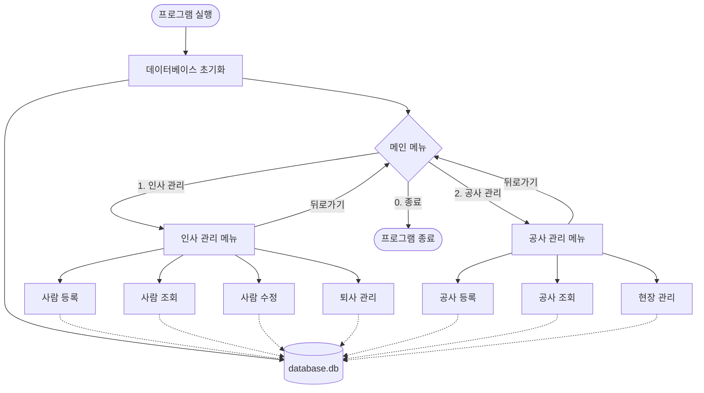
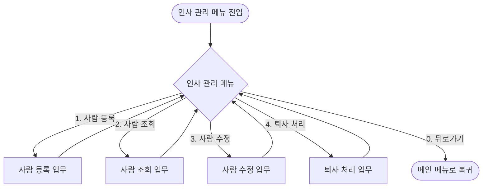
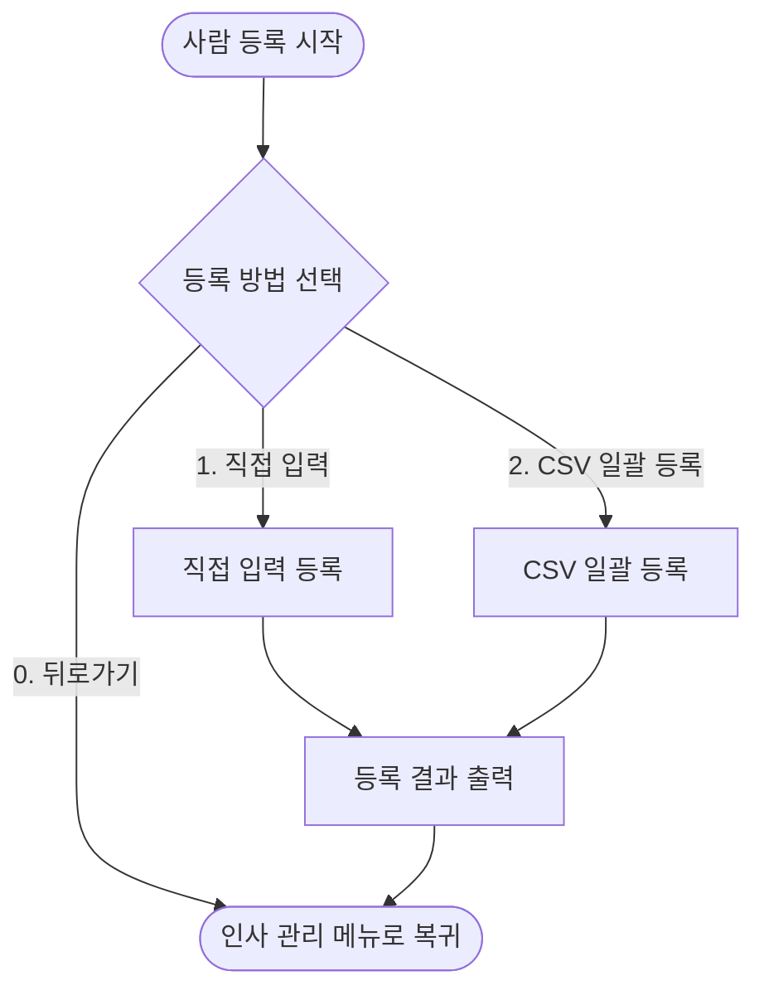
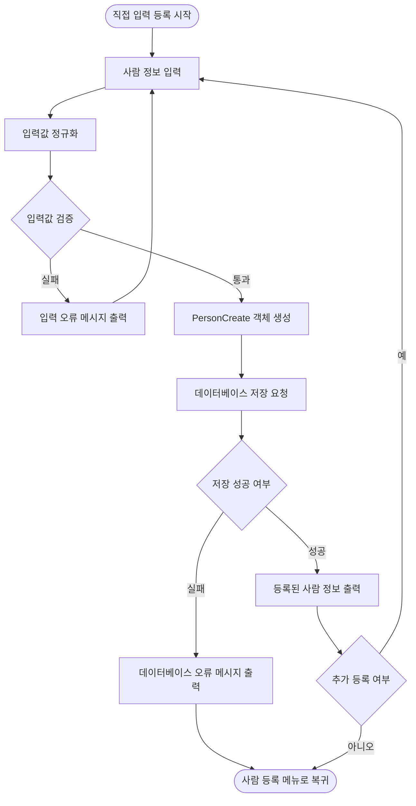
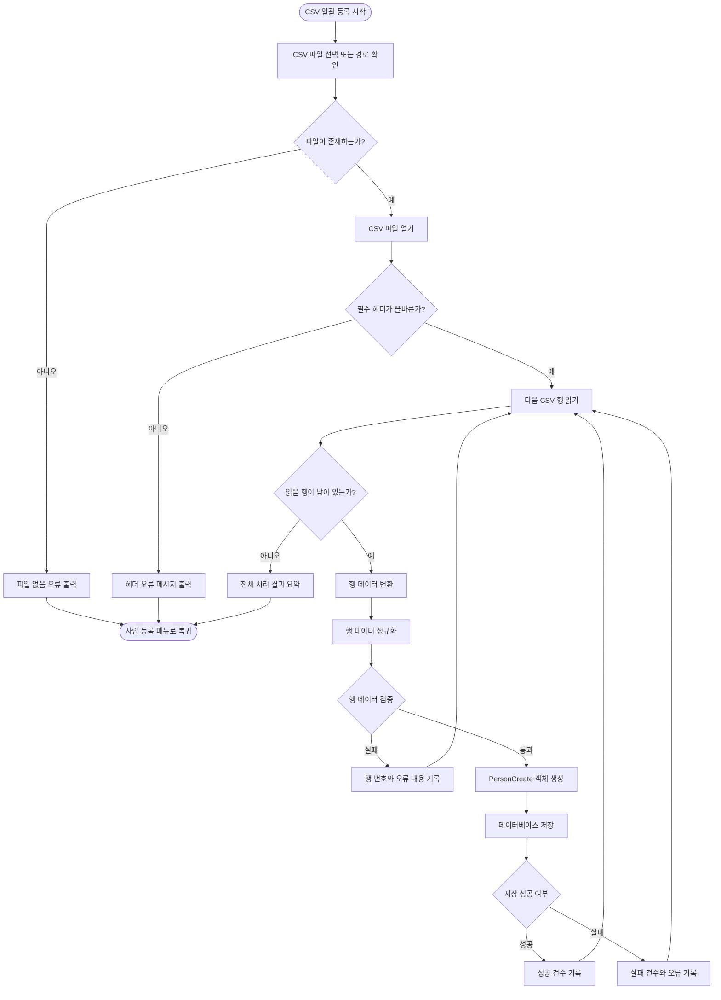
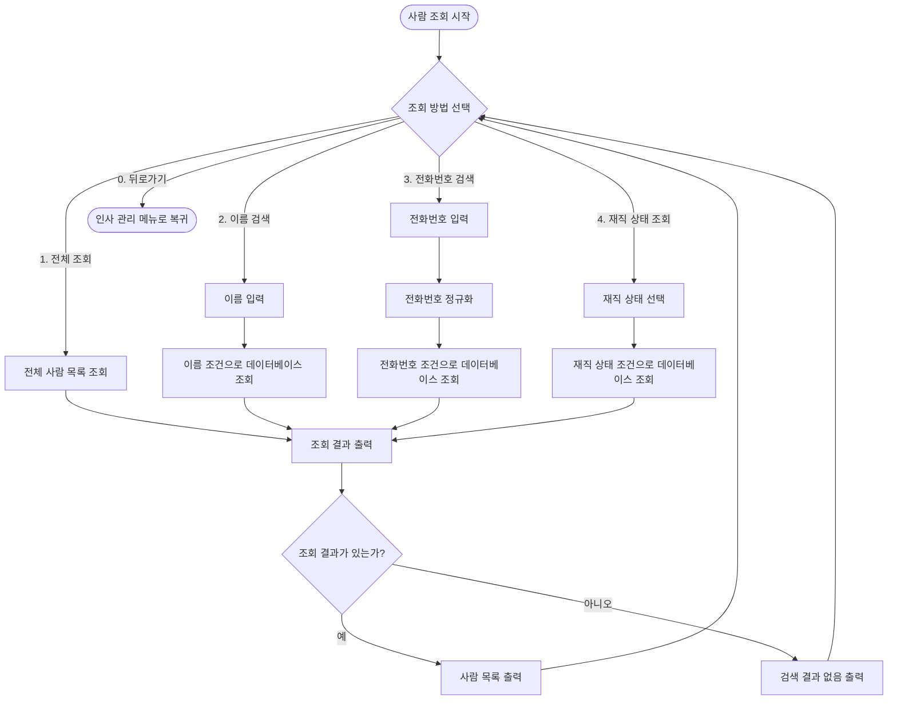
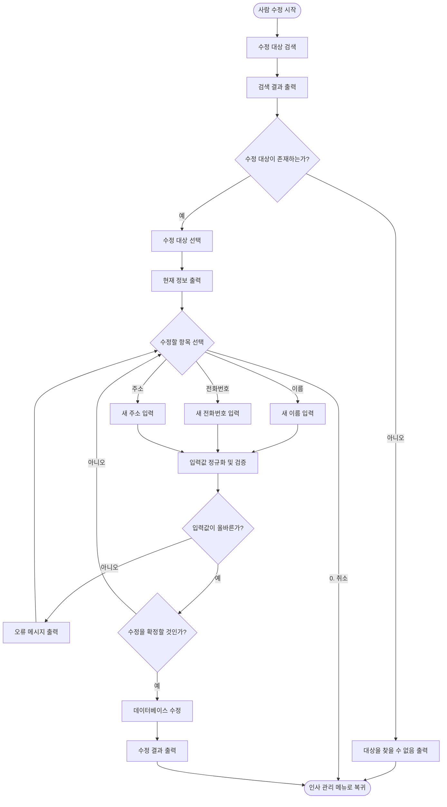
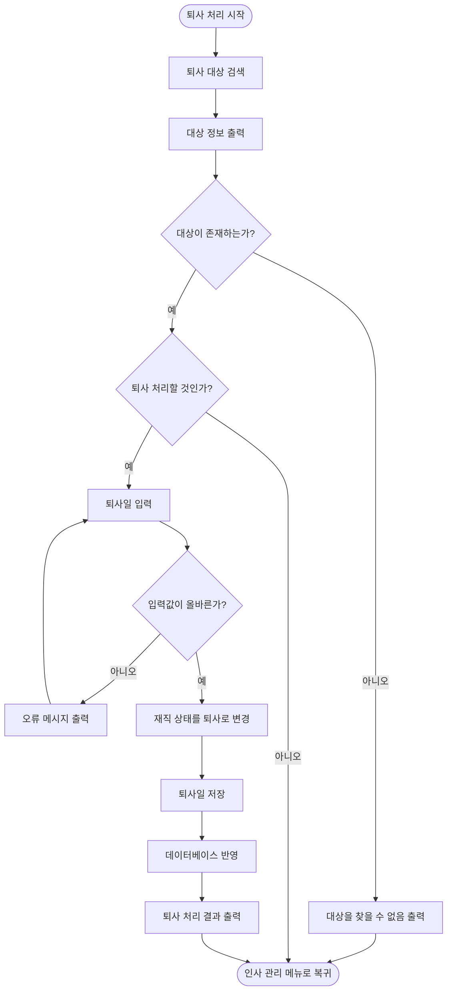
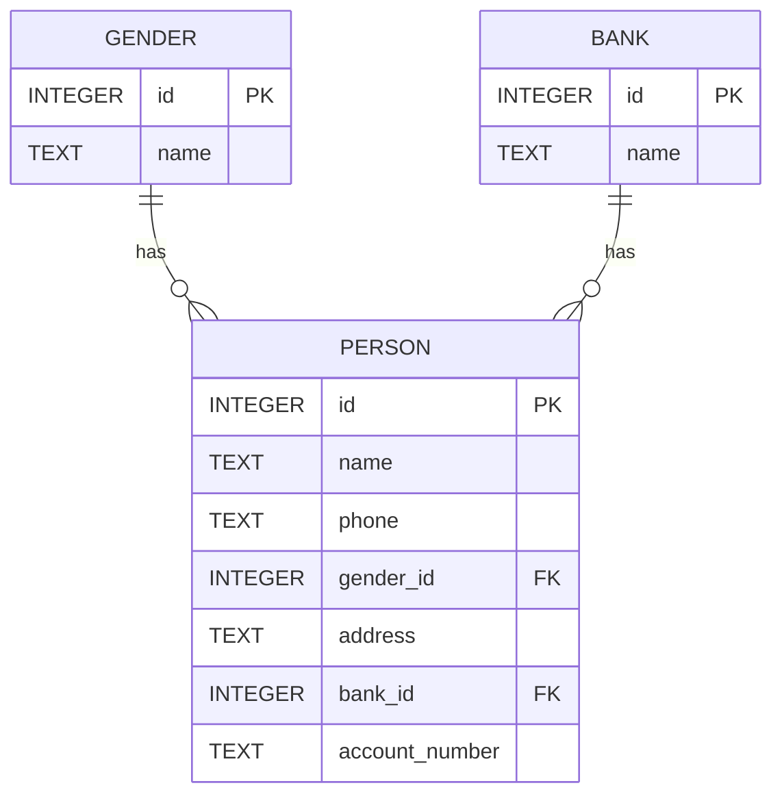
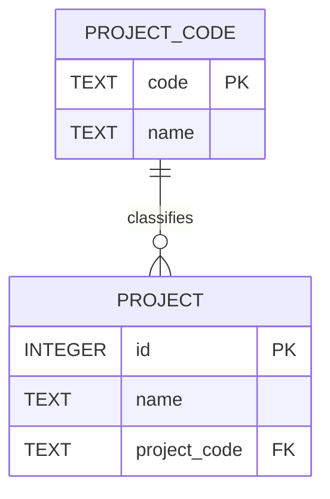

# Development of Namgang Landscape System Program

## 프로잭트 구조
```
src/main/java
├─ config
│  ├─ PathConfig.java
│  └─ UiConfig.java
│
├─ database
│  ├─ DatabaseConnection.java
│  └─ DatabaseInitializer.java
│
├─ model
│  ├─ Person.java
│  └─ PersonCreate.java
│
├─ normalizer
│  └─ PersonNormalizer.java
│
├─ repository
│  └─ PersonRepository.java
│
├─ service
│  └─ PersonRegistrationService.java
│
├─ validator
│  └─ PersonValidator.java
│
└─ ui
    ├─ input
    │  ├─ MenuInputReader.java
    │  └─ PersonInputReader.java
    │
    └─ menu
        ├─ MainMenu.java
        └─ PersonMenu.java
```


## Program Flowchart


### 인사관리 업무 흐름도


#### 사람 등록 업무 상세 흐름도


##### 직접 입력 등록 상세 흐름도


##### CSV 일괄 등록 상세 흐름도


#### 조회 업무 흐름도


#### 수정 업무 흐름도

#### 퇴사 처리 흐름도



## 데이터베이스 ER 다이어그램

### Person


### Project


