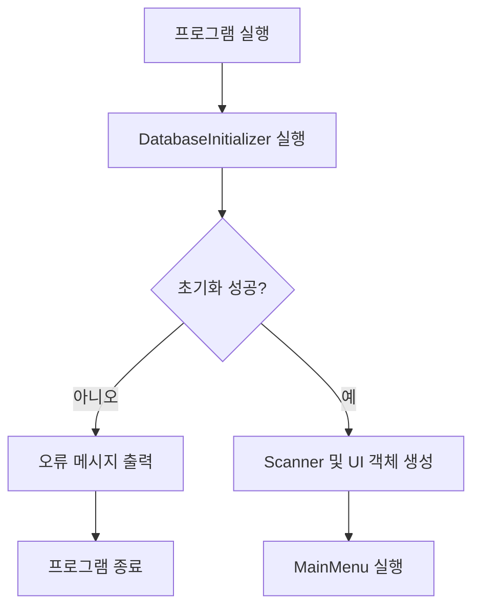
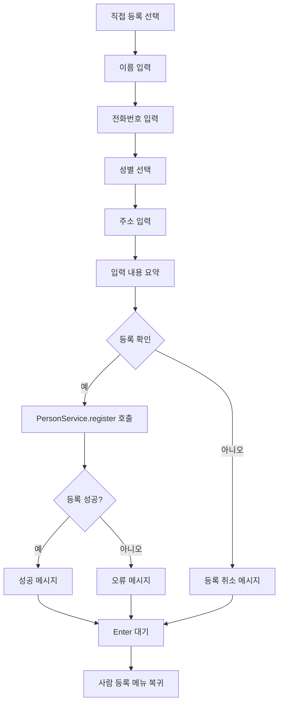

# NGSP_JAVA UI 흐름 설계

## 1. 문서 개요

### 1.1 문서 목적

이 문서는 `NGSP_JAVA` 프로젝트의 CLI 사용자 인터페이스 구조와 화면 이동 흐름을 정의합니다.

주요 목적은 다음과 같습니다.

* 메뉴 간 이동 방식을 일관되게 유지
* 사용자 입력과 업무 처리 코드 분리
* 기능 실행 후 결과 메시지를 충분히 읽을 수 있도록 구성
* 잘못된 입력으로 프로그램이 종료되지 않도록 처리
* 사람 관리 이후 공사·현장·급여 메뉴를 같은 방식으로 확장
* UI 클래스에 업무 로직과 SQL이 들어가는 것을 방지
* 개발자가 메뉴를 추가할 때 따를 공통 기준 제공

이 문서는 CLI 환경을 기준으로 작성하지만, UI와 Service가 분리된 구조를 유지하여 향후 GUI 또는 웹 UI로 교체할 수 있도록 설계합니다.

---

## 2. UI 기본 방향

### 2.1 UI 형식

NGSP_JAVA는 초기 버전에서 터미널 기반 CLI를 사용합니다.

```text
User Interface  CLI
Input           Keyboard
Output          Terminal
Menu Selection  Number
Navigation      Hierarchical Menu
```

사용자는 숫자를 입력하여 메뉴를 선택합니다.

```text
메뉴를 선택하세요: 1
```

---

### 2.2 UI의 역할

UI 계층은 사용자와 프로그램 사이의 대화를 담당합니다.

UI가 담당하는 일:

* 메뉴 출력
* 입력 안내 문구 출력
* 사용자 입력 수집
* 입력값을 Service에 전달
* 처리 결과 출력
* 오류 메시지 출력
* 이전 메뉴 이동
* 프로그램 종료 선택

UI가 담당하지 않는 일:

* SQL 작성
* JDBC 연결
* 데이터베이스 저장
* CSV 데이터 저장
* 중복 여부 판단
* 업무 규칙 결정
* 데이터베이스 테이블 생성

전체 흐름:

```text
사용자
→ UI
→ Service
→ Repository
→ SQLite
```

결과 반환:

```text
SQLite
→ Repository
→ Service
→ UI
→ 사용자
```

---

## 3. UI 계층 구조

현재 및 향후 UI 패키지는 다음과 같이 구성합니다.

```text
ui/
├── input/
│   ├── MenuInputReader.java
│   └── PersonInputReader.java
│
├── menu/
│   ├── MainMenu.java
│   ├── PersonMenu.java
│   └── PersonRegistrationMenu.java
│
└── formatter/
    └── PersonConsoleFormatter.java
```

프로젝트 전체 Formatter를 별도 최상위 패키지에서 관리할 수도 있습니다.

```text
formatter/
└── PersonFormatter.java
```

현재 단계에서는 출력 책임이 커질 때 별도 클래스로 분리합니다.

---

## 4. 메뉴 계층

NGSP_JAVA의 메뉴는 단계별 계층 구조를 가집니다.

```text
MainMenu
├── PersonMenu
│   ├── PersonRegistrationMenu
│   │   ├── 직접 등록
│   │   └── CSV 등록
│   ├── 사람 조회
│   ├── 사람 수정
│   └── 사람 삭제
│
├── ProjectMenu
├── WorkSiteMenu
└── 기타 업무 메뉴
```

현재 구현 범위:

```text
MainMenu
→ PersonMenu
→ PersonRegistrationMenu
```

향후 확장 범위:

```text
MainMenu
├── PersonMenu
├── ProjectMenu
├── WorkSiteMenu
├── DailyWorkMenu
└── PayrollMenu
```

---

## 5. 전체 프로그램 흐름

### 5.1 프로그램 시작

```text
사용자 프로그램 실행
→ Main.main()
→ 데이터베이스 초기화
→ Scanner 생성
→ UI 객체 생성
→ MainMenu.run()
```

흐름도:



---

### 5.2 정상 종료

사용자가 메인 메뉴에서 `0`을 선택하면 프로그램을 종료합니다.

```text
MainMenu
→ 0. 프로그램 종료
→ 반복문 종료
→ Main으로 반환
→ Scanner 종료
→ 프로그램 종료
```

하위 메뉴의 `0`은 프로그램 종료가 아니라 이전 메뉴 복귀입니다.

```text
PersonMenu의 0
→ MainMenu로 복귀

PersonRegistrationMenu의 0
→ PersonMenu로 복귀
```

---

## 6. 메인 메뉴

### 6.1 화면 예시

```text
=======================================
 남강조경 시스템
=======================================
1. 사람 관리
2. 공사 관리
3. 현장 관리
4. 작업 관리
5. 급여 관리
0. 프로그램 종료
=======================================

메뉴를 선택하세요:
```

현재 미구현 메뉴는 화면에 표시하지 않거나, 선택 시 준비 중 메시지를 표시할 수 있습니다.

초기 개발 단계 권장 방식:

```text
1. 사람 관리
0. 프로그램 종료
```

기능이 실제로 구현될 때 메뉴 항목을 추가하는 것이 사용자 혼란을 줄입니다.

---

### 6.2 메인 메뉴 선택 흐름

|  입력 | 동작                     |
| --: | ---------------------- |
| `1` | 사람 관리 메뉴 실행            |
| `2` | 공사 관리 메뉴 실행 또는 준비 중 안내 |
| `3` | 현장 관리 메뉴 실행 또는 준비 중 안내 |
| `0` | 프로그램 종료                |
| 그 외 | 잘못된 메뉴 안내 후 재입력        |

---

### 6.3 MainMenu 책임

`MainMenu`가 담당하는 내용:

* 시스템 이름 출력
* 최상위 메뉴 출력
* 사용자 메뉴 번호 입력
* 각 하위 메뉴 실행
* 프로그램 종료 처리

`MainMenu`가 담당하지 않는 내용:

* 사람 등록
* 공사 데이터 조회
* DB 초기화
* SQL 실행

---

### 6.4 예상 코드 구조

```java
public final class MainMenu {

    private final MenuInputReader menuInputReader;
    private final PersonMenu personMenu;

    public MainMenu(
            MenuInputReader menuInputReader,
            PersonMenu personMenu
    ) {
        this.menuInputReader = menuInputReader;
        this.personMenu = personMenu;
    }

    public void run() {
        boolean running = true;

        while (running) {
            printMenu();

            int choice =
                    menuInputReader.readChoice(
                            "메뉴를 선택하세요: "
                    );

            switch (choice) {
                case 1 -> personMenu.run();
                case 0 -> running = false;
                default -> printInvalidChoice();
            }
        }

        System.out.println(
                "프로그램을 종료합니다."
        );
    }
}
```

---

## 7. 사람 관리 메뉴

### 7.1 화면 예시

```text
=======================================
 사람 관리
=======================================
1. 사람 등록
2. 사람 조회
3. 사람 수정
4. 사람 삭제
0. 메인 메뉴로 돌아가기
=======================================

메뉴를 선택하세요:
```

---

### 7.2 선택 흐름

|  입력 | 동작              |
| --: | --------------- |
| `1` | 사람 등록 메뉴 실행     |
| `2` | 사람 조회 기능 실행     |
| `3` | 사람 수정 기능 실행     |
| `4` | 사람 삭제 기능 실행     |
| `0` | 메인 메뉴로 복귀       |
| 그 외 | 오류 메시지 출력 후 재입력 |

---

### 7.3 PersonMenu 책임

담당:

* 사람 관리 메뉴 출력
* 등록 메뉴 실행
* 조회 기능 실행
* 수정 기능 실행
* 삭제 기능 실행
* 상위 메뉴 복귀

담당하지 않음:

* 사람 정보 직접 입력
* 입력값 검증
* SQL 실행
* 데이터베이스 연결
* CSV 파싱

---

### 7.4 예상 코드 흐름

```java
public void run() {
    boolean running = true;

    while (running) {
        printMenu();

        int choice =
                menuInputReader.readChoice(
                        "메뉴를 선택하세요: "
                );

        switch (choice) {
            case 1 ->
                    personRegistrationMenu.run();

            case 2 ->
                    showPersonList();

            case 3 ->
                    updatePerson();

            case 4 ->
                    deletePerson();

            case 0 ->
                    running = false;

            default ->
                    printInvalidChoice();
        }
    }
}
```

현재 `1`번을 선택했을 때 준비 중 메시지만 출력하는 구조에서 다음 구조로 변경합니다.

```text
기존:
PersonMenu
→ "사람 등록 기능을 준비 중입니다."

변경:
PersonMenu
→ PersonRegistrationMenu.run()
```

---

## 8. 사람 등록 메뉴

### 8.1 화면 예시

```text
=======================================
 사람 등록
=======================================
1. 직접 입력하여 등록
2. CSV 파일로 일괄 등록
0. 사람 관리 메뉴로 돌아가기
=======================================

메뉴를 선택하세요:
```

---

### 8.2 선택 흐름

|  입력 | 동작           |
| --: | ------------ |
| `1` | 사람 직접 등록 화면  |
| `2` | CSV 일괄 등록    |
| `0` | 사람 관리 메뉴로 복귀 |
| 그 외 | 오류 안내 후 재입력  |

---

### 8.3 직접 등록 흐름



---

### 8.4 직접 등록 화면 예시

```text
=======================================
 사람 직접 등록
=======================================

이름을 입력하세요: 홍길동
전화번호를 입력하세요: 010-1234-5678

성별을 선택하세요.
1. 남성
2. 여성
0. 등록 취소

성별: 1
주소를 입력하세요: 경상남도 의령군
```

입력 완료 후 내용을 확인합니다.

```text
=======================================
 입력 정보 확인
=======================================
이름       : 홍길동
전화번호   : 010-1234-5678
성별       : 남성
주소       : 경상남도 의령군
=======================================

이 정보로 등록하시겠습니까?
1. 등록
2. 다시 입력
0. 취소

선택:
```

---

### 8.5 확인 단계 필요성

입력 즉시 저장하지 않고 확인 단계를 제공하는 것이 좋습니다.

이유:

* 전화번호 오입력 방지
* 성별 선택 오류 방지
* 주소 오타 확인
* 잘못 입력한 데이터를 DB에서 다시 수정하는 불편 감소

초기 버전에서 구현이 복잡하다면 확인 단계를 생략할 수 있지만, 실제 업무 사용 전에는 추가하는 것을 권장합니다.

---

### 8.6 등록 완료 화면

```text
=======================================
 사람 등록 완료
=======================================
등록 번호 : 1
이름      : 홍길동
전화번호  : 010-1234-5678

사람 등록이 완료되었습니다.

계속하려면 Enter 키를 누르세요.
```

Enter 입력 후 `PersonRegistrationMenu`로 돌아갑니다.

---

### 8.7 등록 실패 화면

중복 전화번호:

```text
=======================================
 등록 실패
=======================================
이미 등록된 전화번호입니다.

전화번호: 010-1234-5678

계속하려면 Enter 키를 누르세요.
```

잘못된 성별:

```text
존재하지 않는 성별 정보입니다.
성별을 다시 선택해 주세요.
```

DB 연결 실패:

```text
사람 정보를 저장하지 못했습니다.
데이터베이스 연결 상태를 확인해 주세요.

계속하려면 Enter 키를 누르세요.
```

사용자에게 JDBC 또는 SQLite 예외 원문을 그대로 표시하지 않습니다.

---

## 9. CSV 등록 흐름

### 9.1 화면 예시

```text
=======================================
 CSV 사람 일괄 등록
=======================================

대상 파일:
data/input/person.csv

CSV 파일을 불러오시겠습니까?
1. 등록 시작
0. 취소

선택:
```

---

### 9.2 처리 흐름

```text
CSV 등록 선택
→ 파일 존재 확인
→ 헤더 검사
→ 각 행 읽기
→ 정규화
→ 검증
→ PersonCreate 변환
→ PersonService 등록
→ 결과 집계
→ 결과 화면 출력
```

---

### 9.3 파일 없음

```text
=======================================
 CSV 파일 오류
=======================================
CSV 파일을 찾을 수 없습니다.

확인 경로:
data/input/person.csv

파일을 해당 경로에 넣은 후 다시 시도해 주세요.

계속하려면 Enter 키를 누르세요.
```

---

### 9.4 헤더 오류

```text
=======================================
 CSV 형식 오류
=======================================
필수 헤더가 누락되었습니다.

필수 헤더:
name, phone, gender_id, address

누락된 헤더:
gender_id

계속하려면 Enter 키를 누르세요.
```

---

### 9.5 등록 결과

```text
=======================================
 CSV 등록 결과
=======================================
전체 행 수 : 100
등록 성공  : 97
등록 실패  : 3
=======================================

실패 내역:
- 5행: 전화번호 형식이 올바르지 않습니다.
- 18행: 이미 등록된 전화번호입니다.
- 43행: 존재하지 않는 성별 ID입니다.

계속하려면 Enter 키를 누르세요.
```

오류가 많다면 모든 내용을 터미널에 출력하기보다 오류 보고 파일을 생성하는 방법을 검토합니다.

```text
data/output/person_import_errors.csv
```

이 기능은 CSV 등록이 안정화된 후 추가합니다.

---

## 10. 사람 조회 흐름

### 10.1 조회 메뉴 예시

조회 방식이 늘어나면 세부 메뉴를 둘 수 있습니다.

```text
=======================================
 사람 조회
=======================================
1. 전체 사람 조회
2. ID로 조회
3. 이름으로 검색
4. 전화번호로 검색
0. 사람 관리 메뉴로 돌아가기
=======================================

메뉴를 선택하세요:
```

초기 구현에서는 전체 조회만 제공해도 충분합니다.

```text
PersonMenu
→ 2. 사람 조회
→ 전체 사람 목록 출력
```

---

### 10.2 전체 조회 화면

```text
=======================================
 사람 목록
=======================================
ID   이름       전화번호        성별   주소
---------------------------------------
1    홍길동     010-1234-5678   남성   경상남도 의령군
2    김영희     010-9876-5432   여성   경상남도 진주시
=======================================
총 2명이 등록되어 있습니다.

계속하려면 Enter 키를 누르세요.
```

---

### 10.3 조회 결과 없음

```text
=======================================
 사람 목록
=======================================
등록된 사람이 없습니다.

사람 등록 메뉴에서 먼저 사람을 등록해 주세요.

계속하려면 Enter 키를 누르세요.
```

---

### 10.4 긴 목록 처리

사람 수가 많아지면 한 화면에 전부 출력하는 것은 불편합니다.

초기 방식:

```text
전체 목록 출력
```

향후 방식:

```text
한 페이지 20명
N. 다음 페이지
P. 이전 페이지
0. 돌아가기
```

초기 데이터가 적을 때는 페이지 기능을 구현하지 않습니다.

---

## 11. 사람 상세 조회 흐름

### 11.1 입력 화면

```text
=======================================
 사람 상세 조회
=======================================

조회할 사람 ID를 입력하세요.
0을 입력하면 취소합니다.

ID:
```

---

### 11.2 조회 성공

```text
=======================================
 사람 상세 정보
=======================================
ID         : 1
이름       : 홍길동
전화번호   : 010-1234-5678
성별       : 남성
주소       : 경상남도 의령군
=======================================

계속하려면 Enter 키를 누르세요.
```

---

### 11.3 존재하지 않는 ID

```text
ID 99에 해당하는 사람을 찾을 수 없습니다.

다시 입력하거나 0을 입력하여 돌아가세요.
```

존재하지 않는 ID가 입력되어도 프로그램이 종료되지 않습니다.

---

## 12. 사람 수정 흐름

### 12.1 전체 흐름

```text
수정 메뉴 선택
→ 수정할 사람 ID 입력
→ 기존 정보 조회
→ 기존 정보 출력
→ 변경값 입력
→ 입력 요약
→ 수정 확인
→ Service 호출
→ 수정 결과 출력
→ Enter 대기
→ PersonMenu 복귀
```

---

### 12.2 대상 선택

```text
=======================================
 사람 정보 수정
=======================================

수정할 사람 ID를 입력하세요.
0을 입력하면 취소합니다.

ID: 1
```

---

### 12.3 기존 정보 출력

```text
현재 정보:

이름       : 홍길동
전화번호   : 010-1234-5678
성별       : 남성
주소       : 경상남도 의령군
```

---

### 12.4 수정 입력 원칙

기존 값을 유지할 수 있도록 빈 입력을 허용하는 방식을 권장합니다.

```text
새 이름을 입력하세요.
현재 값을 유지하려면 Enter를 누르세요.

이름 [홍길동]:
```

예:

```text
이름 [홍길동]:
전화번호 [010-1234-5678]: 010-1111-2222
성별 [남성]:
주소 [경상남도 의령군]:
```

결과:

```text
이름       : 홍길동
전화번호   : 010-1111-2222
성별       : 남성
주소       : 경상남도 의령군
```

---

### 12.5 수정 확인

```text
=======================================
 수정 정보 확인
=======================================
이름       : 홍길동
전화번호   : 010-1111-2222
성별       : 남성
주소       : 경상남도 의령군
=======================================

이 정보로 수정하시겠습니까?
1. 수정
2. 다시 입력
0. 취소

선택:
```

---

### 12.6 수정 완료

```text
사람 정보가 수정되었습니다.

계속하려면 Enter 키를 누르세요.
```

---

## 13. 사람 삭제 흐름

### 13.1 전체 흐름

```text
삭제 메뉴 선택
→ 사람 ID 입력
→ 대상 조회
→ 대상 정보 출력
→ 삭제 확인
→ Service 호출
→ 삭제 결과 출력
→ Enter 대기
→ PersonMenu 복귀
```

---

### 13.2 대상 입력

```text
=======================================
 사람 삭제
=======================================

삭제할 사람 ID를 입력하세요.
0을 입력하면 취소합니다.

ID: 1
```

---

### 13.3 삭제 확인

```text
=======================================
 삭제 대상
=======================================
ID         : 1
이름       : 홍길동
전화번호   : 010-1234-5678
성별       : 남성
주소       : 경상남도 의령군
=======================================

정말 삭제하시겠습니까?
1. 삭제
0. 취소

선택:
```

삭제처럼 복구가 어려운 작업에는 반드시 확인 단계를 둡니다.

---

### 13.4 삭제 완료

물리 삭제:

```text
홍길동님의 정보가 삭제되었습니다.

계속하려면 Enter 키를 누르세요.
```

논리 삭제:

```text
홍길동님의 상태가 비활성으로 변경되었습니다.

과거 공사 및 근무 기록은 유지됩니다.

계속하려면 Enter 키를 누르세요.
```

---

## 14. 입력 처리 설계

### 14.1 MenuInputReader

`MenuInputReader`는 메뉴 번호처럼 정수 입력을 전담합니다.

주요 메서드 예:

```java
public int readChoice(String prompt);

public int readChoice(
        String prompt,
        int min,
        int max
);

public void waitForEnter();

public boolean readConfirmation(
        String prompt
);
```

---

### 14.2 잘못된 숫자 입력

사용자 입력:

```text
메뉴를 선택하세요: 사람
```

출력:

```text
숫자로 입력해 주세요.
```

이후 다시 입력:

```text
메뉴를 선택하세요:
```

`InputMismatchException`으로 프로그램이 종료되지 않도록 합니다.

---

### 14.3 범위 밖 메뉴 입력

사용자 입력:

```text
메뉴를 선택하세요: 9
```

출력:

```text
존재하지 않는 메뉴입니다.
화면에 표시된 번호를 입력해 주세요.
```

---

### 14.4 문자열 기반 입력

`Scanner.nextInt()`와 `nextLine()`을 섞으면 개행 문자가 남아 입력이 건너뛰어지는 문제가 발생할 수 있습니다.

따라서 모든 입력을 `nextLine()`으로 읽은 뒤 필요한 자료형으로 변환하는 방식을 권장합니다.

```java
String input = scanner.nextLine().trim();

try {
    return Integer.parseInt(input);
} catch (NumberFormatException error) {
    // 다시 입력
}
```

이 방식은 메뉴 입력과 문자열 입력을 함께 사용할 때 안정적입니다.

---

## 15. PersonInputReader

`PersonInputReader`는 사람 등록·수정에 필요한 사용자 입력을 담당합니다.

예상 메서드:

```java
public String readName();

public String readPhone();

public int readGenderId();

public String readAddress();

public PersonCreate readPersonCreate();
```

---

### 15.1 입력과 검증의 경계

`PersonInputReader`에서 할 수 있는 기본 검증:

* 아무것도 입력하지 않았는지 확인
* 숫자 입력 여부 확인
* 메뉴 범위 확인

Service 또는 Validator가 담당할 업무 검증:

* 전화번호가 010으로 시작하는지
* 전화번호 중복 여부
* 성별 ID가 DB에 존재하는지
* 이름 최소 길이
* 등록 가능한 상태인지

입력 클래스가 모든 업무 규칙을 판단하지 않습니다.

---

## 16. 메시지 표시 원칙

### 16.1 결과 메시지를 읽을 시간 제공

기능 실행 직후 메뉴가 다시 출력되면 결과 메시지가 위로 밀려 사용자가 읽기 어렵습니다.

잘못된 흐름:

```text
사람 등록이 완료되었습니다.
=======================================
 사람 등록
=======================================
1. 직접 입력
2. CSV 등록
```

권장 흐름:

```text
사람 등록이 완료되었습니다.

계속하려면 Enter 키를 누르세요.
```

사용자가 Enter를 입력한 후 메뉴를 다시 표시합니다.

```text
결과 메시지
→ waitForEnter()
→ 다음 메뉴
```

---

### 16.2 고정 대기시간을 사용하지 않음

다음 방식은 권장하지 않습니다.

```java
Thread.sleep(3000);
```

문제점:

* 사용자가 읽기 전에 화면이 바뀔 수 있음
* 이미 읽었는데도 기다려야 함
* 컴퓨터 환경에 따라 체감 시간이 다름
* 테스트가 느려짐
* 프로그램이 멈춘 것처럼 느껴질 수 있음

사용자 입력 기반 대기:

```java
menuInputReader.waitForEnter();
```

이 방식이 더 적합합니다.

---

### 16.3 일관된 문장

메시지는 가능한 한 동일한 형식을 사용합니다.

성공:

```text
사람 등록이 완료되었습니다.
사람 정보가 수정되었습니다.
사람 정보가 삭제되었습니다.
```

실패:

```text
사람 등록에 실패했습니다.
사람 정보를 불러오지 못했습니다.
사람 정보 수정에 실패했습니다.
```

입력 오류:

```text
숫자로 입력해 주세요.
필수 입력값입니다.
존재하지 않는 메뉴입니다.
```

---

### 16.4 메시지 위치

결과 메시지는 화면 상단에 한 줄만 출력하기보다 별도의 결과 영역으로 구분합니다.

```text
=======================================
 처리 결과
=======================================
사람 등록이 완료되었습니다.
=======================================

계속하려면 Enter 키를 누르세요.
```

지나치게 모든 메시지를 박스로 만들 필요는 없습니다.

권장 구분:

* 메뉴 제목: 박스 사용
* 중요한 성공·실패 결과: 박스 사용 가능
* 일반 입력 오류: 한두 줄 출력
* 반복 입력 안내: 간단히 출력

---

## 17. 화면 구분선 설계

### 17.1 공통 구분선

`UiConfig`에서 공통 구분선을 관리합니다.

```java
public static final String DIVIDER =
        "=======================================";
```

사용 예:

```java
System.out.println(UiConfig.DIVIDER);
System.out.println(" 사람 관리");
System.out.println(UiConfig.DIVIDER);
```

---

### 17.2 제목 형식

권장:

```text
=======================================
 사람 관리
=======================================
```

하위 작업:

```text
---------------------------------------
 사람 직접 등록
---------------------------------------
```

상위 메뉴와 세부 작업의 구분선을 다르게 사용할 수도 있지만, 초기에는 하나로 통일하는 것이 관리하기 쉽습니다.

---

## 18. 화면 지우기 정책

터미널 화면을 매번 강제로 지우는 기능은 초기에는 사용하지 않는 것을 권장합니다.

장점:

* 이전 결과 확인 가능
* 디버깅이 쉬움
* 터미널 호환성 문제 없음

단점:

* 화면 내용이 누적됨
* 오래 사용하면 복잡해짐

초기 권장 방식:

```text
빈 줄 1~2개 출력
→ 새 메뉴 출력
```

향후 화면 지우기를 추가한다면 운영체제 명령을 직접 실행하기보다 ANSI escape code 지원 여부를 확인해야 합니다.

다만 사용자 취향에 따라 다음 옵션을 둘 수 있습니다.

```text
UiConfig.CLEAR_SCREEN_ENABLED
```

기본값은 `false`를 권장합니다.

---

## 19. 메뉴 반복 원칙

각 메뉴는 자체 반복문을 가집니다.

```java
public void run() {
    while (true) {
        printMenu();

        int choice = readChoice();

        if (choice == 0) {
            return;
        }

        handleChoice(choice);
    }
}
```

`return`은 호출한 상위 메뉴로 돌아가는 것을 의미합니다.

호출 관계:

```text
MainMenu.run()
  └─ PersonMenu.run()
       └─ PersonRegistrationMenu.run()
```

`PersonRegistrationMenu.run()`이 종료되면 `PersonMenu.run()`의 다음 반복이 실행됩니다.

---

## 20. System.exit 사용 원칙

하위 메뉴에서는 `System.exit()`를 사용하지 않습니다.

잘못된 예:

```java
case 0 -> System.exit(0);
```

사람 등록 메뉴의 `0`을 눌렀는데 프로그램 전체가 종료될 수 있습니다.

권장:

```java
case 0 -> {
    return;
}
```

프로그램 전체 종료는 MainMenu가 결정합니다.

---

## 21. 의존성 연결

각 메뉴는 필요한 객체를 생성자에서 전달받습니다.

```text
Main
→ MainMenu
→ PersonMenu
→ PersonRegistrationMenu
```

예:

```java
public PersonMenu(
        MenuInputReader menuInputReader,
        PersonRegistrationMenu personRegistrationMenu,
        PersonService personService
) {
    this.menuInputReader =
            menuInputReader;

    this.personRegistrationMenu =
            personRegistrationMenu;

    this.personService =
            personService;
}
```

메뉴 내부에서 하위 메뉴를 직접 생성하는 방식은 지양합니다.

지양:

```java
PersonRegistrationMenu menu =
        new PersonRegistrationMenu(...);
```

권장:

```java
personRegistrationMenu.run();
```

생성자 주입을 사용하면 메뉴 연결 구조가 `Main`에 명확하게 드러납니다.

---

## 22. 예외 처리 흐름

### 22.1 사용자 입력 오류

```text
사용자 잘못된 입력
→ InputReader에서 처리
→ 오류 메시지
→ 재입력
```

예:

```text
숫자로 입력해 주세요.
```

---

### 22.2 업무 규칙 오류

```text
Service에서 예외 발생
→ Menu가 메시지 표시
→ Enter 대기
→ 메뉴 복귀
```

예:

```text
이미 등록된 전화번호입니다.
```

---

### 22.3 시스템 오류

```text
Repository 또는 DB 오류
→ Service에서 애플리케이션 오류로 변환
→ UI에서 일반적인 메시지 표시
→ 상세 내용은 로그에 기록
```

사용자 메시지:

```text
데이터를 저장하는 중 오류가 발생했습니다.
```

개발 로그:

```text
SQLException:
UNIQUE constraint failed: person.phone
```

---

### 22.4 최상위 예외

예상하지 못한 예외가 Main까지 도달하면 프로그램이 무작정 스택 트레이스를 출력하기보다 최상위 오류 메시지를 제공할 수 있습니다.

```java
try {
    mainMenu.run();
} catch (RuntimeException error) {
    System.err.println(
            "프로그램 실행 중 예기치 않은 오류가 발생했습니다."
    );

    error.printStackTrace();
}
```

개발 단계에서는 스택 트레이스를 확인하고, 배포 단계에서는 로그 파일로 남기는 것을 검토합니다.

---

## 23. 취소 처리 원칙

등록·수정·삭제 과정에서 사용자는 언제든 취소할 수 있어야 합니다.

숫자 입력 화면:

```text
0. 취소
```

문자열 입력 화면에서는 다음과 같은 방식을 사용할 수 있습니다.

```text
취소하려면 /cancel을 입력하세요.
```

그러나 모든 입력마다 `/cancel`을 구현하면 복잡해질 수 있습니다.

초기 권장 방식:

* 메뉴 선택 단계에서 취소 가능
* 최종 확인 단계에서 취소 가능
* 입력 도중 취소 기능은 추후 필요할 때 추가

---

## 24. 확인 입력 원칙

확인 화면에서 `y/n`, `예/아니오`, `1/0` 등을 혼용하지 않습니다.

CLI 전체에서 숫자로 통일하는 것을 권장합니다.

```text
1. 확인
0. 취소
```

수정 화면처럼 다시 입력 기능이 필요하면:

```text
1. 저장
2. 다시 입력
0. 취소
```

---

## 25. 출력 데이터 형식

### 25.1 전화번호

DB 저장:

```text
01012345678
```

화면 출력:

```text
010-1234-5678
```

---

### 25.2 성별

DB 저장:

```text
1
2
```

화면 출력:

```text
남성
여성
```

---

### 25.3 NULL 값

DB 값이 `NULL`인 경우 그대로 `null`이라고 출력하지 않습니다.

권장 표시:

```text
주소: 미등록
```

목록 화면에서는:

```text
-
```

예:

```text
3    이순신    010-1111-2222    남성    -
```

---

### 25.4 긴 문자열

주소처럼 긴 값은 목록 화면에서 일부를 생략하고 상세 조회에서 전체를 표시할 수 있습니다.

목록:

```text
경상남도 의령군...
```

상세:

```text
경상남도 의령군 의령읍 ...
```

초기에는 단순 출력하고 실제 불편이 확인되면 생략 기능을 추가합니다.

---

## 26. 사용자 경험 원칙

### 26.1 현재 위치 표시

모든 메뉴 상단에서 사용자가 현재 어느 기능에 있는지 알 수 있어야 합니다.

```text
사람 관리
사람 등록
사람 직접 등록
```

제목만으로 위치를 알기 어렵다면 경로를 표시할 수 있습니다.

```text
메인 > 사람 관리 > 사람 등록
```

현재 프로젝트에서는 제목만으로 충분하므로 경로 표시는 선택 사항입니다.

---

### 26.2 한 화면에 한 가지 작업

직접 등록 화면에서 조회 목록까지 함께 출력하지 않습니다.

하나의 화면은 하나의 작업에 집중합니다.

```text
등록 화면
조회 화면
수정 화면
삭제 화면
```

---

### 26.3 중요한 작업은 확인

확인 단계가 필요한 작업:

* 신규 등록
* 정보 수정
* 데이터 삭제
* CSV 대량 등록
* 프로그램 종료 중 저장되지 않은 작업이 있을 때

단순 조회에는 확인 단계가 필요하지 않습니다.

---

### 26.4 사용자가 다음 동작을 알 수 있게 함

좋지 않은 메시지:

```text
완료
```

권장 메시지:

```text
사람 등록이 완료되었습니다.

계속하려면 Enter 키를 누르세요.
```

---

### 26.5 오류 후 복구 가능

사용자가 잘못된 값을 입력해도 가능한 한 현재 작업을 이어갈 수 있어야 합니다.

```text
잘못된 전화번호
→ 전화번호만 다시 입력
```

모든 정보를 처음부터 다시 입력하게 하지 않는 것이 좋습니다.

다만 초기 구현에서는 등록 객체 전체를 다시 입력하는 단순 구조로 시작할 수 있습니다.

---

## 27. UI 설정값

공통 UI 설정은 `UiConfig`에서 관리합니다.

예:

```java
public final class UiConfig {

    public static final String APPLICATION_NAME =
            "남강조경 시스템";

    public static final String DIVIDER =
            "=======================================";

    public static final String MENU_PROMPT =
            "메뉴를 선택하세요: ";

    public static final String WAIT_MESSAGE =
            "계속하려면 Enter 키를 누르세요.";

    public static final String INVALID_MENU_MESSAGE =
            "존재하지 않는 메뉴입니다.";

    private UiConfig() {
    }
}
```

모든 문자열을 반드시 Config로 이동할 필요는 없습니다.

여러 화면에서 반복되는 공통 메시지만 상수로 관리합니다.

한 화면에서만 사용하는 문장은 해당 Menu 클래스에 둘 수 있습니다.

---

## 28. 현재 구현 순서

### 1단계: 메뉴 이동 완성

```text
MainMenu
→ PersonMenu
→ PersonRegistrationMenu
```

완료 기준:

* 사람 관리 진입
* 사람 등록 메뉴 진입
* `0`으로 이전 메뉴 복귀
* 프로그램 종료 정상 동작

---

### 2단계: 공통 입력 처리

```text
MenuInputReader.readChoice()
MenuInputReader.waitForEnter()
```

완료 기준:

* 문자 입력 시 재입력
* 잘못된 번호 재입력
* 기능 결과 후 Enter 대기
* Scanner 하나만 사용

---

### 3단계: 직접 등록 UI

```text
PersonInputReader
→ PersonCreate
→ PersonService.register()
```

완료 기준:

* 이름 입력
* 전화번호 입력
* 성별 선택
* 주소 입력
* 등록 결과 출력
* Enter 후 메뉴 복귀

---

### 4단계: 조회 UI

```text
PersonService.getAllPeople()
→ 목록 출력
```

완료 기준:

* 등록된 사람 목록
* 등록된 사람이 없는 경우 안내
* 전화번호 및 성별 표시 변환

---

### 5단계: 수정 UI

완료 기준:

* ID 입력
* 기존 정보 확인
* 변경값 입력
* 수정 확인
* 결과 출력

---

### 6단계: 삭제 UI

완료 기준:

* 대상 조회
* 삭제 확인
* 취소 가능
* 결과 출력

---

### 7단계: CSV 등록 UI

완료 기준:

* 파일 경로 표시
* 실행 확인
* 처리 중 안내
* 성공 및 실패 건수 출력
* 오류 행 안내

---

## 29. 장기 UI 확장

사람 관리 UI가 완성되면 같은 형식으로 다른 메뉴를 확장합니다.

```text
ProjectMenu
├── 공사 등록
├── 공사 조회
├── 공사 수정
└── 공사 종료

WorkSiteMenu
├── 현장 등록
├── 현장 조회
├── 작업 기록
└── 현장 종료

PayrollMenu
├── 급여 계산
├── 급여 조회
├── 지급 처리
└── 급여 명세서
```

모든 도메인 메뉴는 다음 공통 구조를 따릅니다.

```text
등록
조회
수정
삭제 또는 상태 변경
0. 이전 메뉴
```

업무 특성상 삭제가 적절하지 않은 도메인은 상태 변경을 사용합니다.

예:

```text
공사 삭제
```

보다는:

```text
공사 상태를 종료로 변경
```

이 더 적절할 수 있습니다.

---

## 30. GUI 또는 웹 전환 가능성

현재 UI는 CLI이지만 Service와 Repository가 분리되어 있으면 향후 다른 UI를 추가할 수 있습니다.

```text
CLI Menu ───┐
Desktop GUI ├→ PersonService → PersonRepository
Web API ────┘
```

GUI나 웹 UI가 추가되어도 다음 코드는 최대한 재사용합니다.

```text
Person
PersonCreate
PersonService
PersonRepository
DatabaseConnection
```

교체되는 부분:

```text
ui.menu
ui.input
콘솔 Formatter
```

따라서 현재 CLI UI 안에 업무 규칙이나 SQL을 넣지 않는 것이 중요합니다.

---

## 31. UI 흐름 결정 요약

| 항목                 | 결정                     |
| ------------------ | ---------------------- |
| UI 방식              | 터미널 CLI                |
| 메뉴 선택              | 숫자 입력                  |
| 메뉴 구조              | 계층형                    |
| 프로그램 종료            | MainMenu의 `0`          |
| 하위 메뉴 `0`          | 이전 메뉴 복귀               |
| Scanner            | 프로그램 전체에서 하나           |
| 숫자 입력              | `nextLine()` 후 형 변환 권장 |
| 결과 대기              | Enter 입력               |
| 고정 시간 대기           | 사용하지 않음                |
| 메시지 출력             | 성공·오류·안내 구분            |
| 등록                 | 최종 확인 단계 권장            |
| 수정                 | 기존값 표시 및 빈 입력 유지       |
| 삭제                 | 대상 표시 후 재확인            |
| CSV                | 경로·결과·오류 건수 표시         |
| DB 오류              | SQL 원문 대신 사용자 메시지      |
| UI의 SQL 실행         | 금지                     |
| 하위 메뉴의 System.exit | 금지                     |
| 메뉴 의존성             | 생성자 주입                 |
| 화면 지우기             | 초기에는 사용하지 않음           |
| 기능 완료 후 복귀         | 결과 출력 → Enter → 메뉴     |

---

## 32. 최종 UI 원칙

NGSP_JAVA UI는 다음 기준을 유지합니다.

```text
사용자는 현재 위치를 알 수 있어야 한다.

메뉴 번호는 일관되어야 한다.

0번은 종료 또는 이전 메뉴를 의미한다.

기능 결과는 사용자가 읽은 후 넘어가야 한다.

고정 대기시간 대신 Enter 입력을 사용한다.

잘못된 입력으로 프로그램이 종료되어서는 안 된다.

중요한 변경 작업은 실행 전에 확인한다.

UI는 입력과 출력만 담당한다.

업무 판단은 Service가 담당한다.

SQL과 데이터베이스 처리는 Repository가 담당한다.

하나의 Scanner를 모든 입력 클래스가 공유한다.

기능이 추가되어도 같은 메뉴 패턴을 반복 적용한다.
```

현재 가장 먼저 완성할 UI 흐름은 다음과 같습니다.

```text
MainMenu
→ PersonMenu
→ PersonRegistrationMenu
→ 직접 등록
→ 등록 결과
→ Enter 대기
→ PersonRegistrationMenu 복귀
```

이 흐름을 먼저 안정화한 뒤 조회, 수정, 삭제, CSV 등록 순서로 확장합니다.
